# Machine Learning (module 1 part 2)

Based on Passerini’s **lectures** of 2020/2021 and **pdf** of 2021/2022.

> Davide Modolo 2022

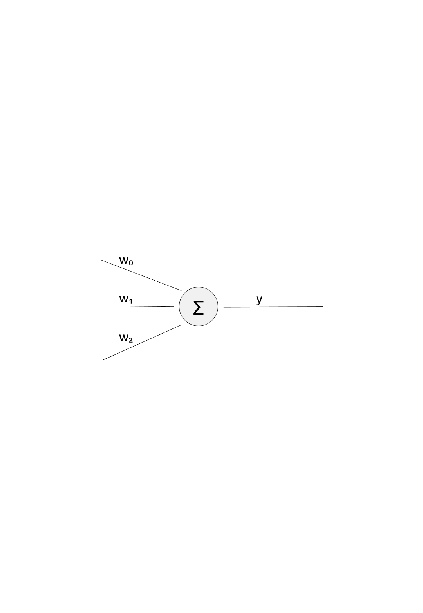

# Linear Discriminant Functions

## Discriminative vs Generative

**Generative** assumes knowledge of the distribution of the data (you want to model the distribution governing the data).

**Discriminative** focuses on modelling the discriminant function (the relation input -> output). You can ignore modelling the probability, focussing only on predicting the boundary

## Pros and Cons of Discriminative Learning

**Pros**:

- with complex data, modelling their distribution can be difficult/expensive
- if the discrimination is the goal, data distribution modelling is not needed
- build the model to fitting the parameters on the desired goal (for example in image recognition, if we want to understand what an object is we can ignore the probability of pixels)

**Cons**:

- models less flexible because they have a fixed input and a fixed output
- for arbitrary inference task and for sampling examples (generate new $x$) you need generative models

## Linear Function

$f(\bold x) = \bold w^T \bold x + w_0$, where $w_0$ is the _bias_ (or _threshold_) and produces a real value

### Binary Classification with a Linear Function

You want to take the produced real value to predict the class, taking for example the sign of the result: $f(\bold x) = sign(\bold w^T \bold x + w_0)$ [positive = class1, negative = class2]

The decision boundary $f(\bold x) = 0$ is an _hyperplane_ $H$; the _weight vector_ $\bold w$ is orthogonal to the decision hyperplane.

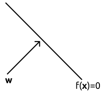

So, if we take $\bold x$ and $\bold x'$: $\forall \bold x, \bold x ': f(\bold x) = f(\bold x) = 0$ we substitute $\bold x$ with $\bold w ^ T \bold x + w_0$ so we get $\bold w ^ T \bold x + w_0 - \bold w ^ T \bold x' + w_0 = 0$, in the end we get that the vector $\bold w$ is orthogonal because $\bold w^T (\bold x - \bold x') = 0$ (it means that the vector $\bold w$ is orthogonal to the “grey” vector because their dot product is $0$)

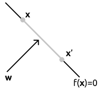

## The Margin (confidence of classifier)

### Functional Margin

The value of $f(\bold x)$ is the **functional margin** (it’s the _confidence_ because it’s the margin before predicting the following class).

### Geometric Margin

The **geometric margin** (the _distance_ from the hyperplane) and it’s the functional margin divided by the _norm of the weight vector_ (it’s a normalized version of the functional margin): $\displaystyle r^\bold x = \frac{f(\bold x)}{||\bold w||}$; the distance from the origin to the hyperplane is $\displaystyle r^0 = \frac{f(0)}{\|\bold w\|} = \frac{w_0}{\|\bold w\|}$

$\rightarrow$ a point can be expressed by its projection on $H$ plus its distance from $H$ times the unit vector in that direction $\displaystyle\bold x = \bold x^p + r^x\frac{\bold w}{\|\bold w\|}$
$$
f(\bold x^p)=0 \\
\Rightarrow f(\bold x) =  \bold w^T \bold x + w_0\\
= \bold w^T(\bold x ^ p+r^x \frac{\bold w}{\|\bold w\|}) + w_0\\
=\overbrace{\bold w^T\bold x^p + w_0} ^{f(\bold x^p) = 0}+ r^x\bold w^T\frac{\bold w}{\|\bold w\|}\\
=r^x\|\bold w\|\\
\Rightarrow  \frac{f(\bold x)}{\|\bold w\|}=r^x
$$

## Perceptron

> the starting point for neural networks

Inspired by the way the human brain processes the information, the **perceptron** (single neuron) architecture is the linear combination of input features with a threshold activation function: $f(x) = sign(\bold w^T \bold x + w_0)$

A single linear classifier can represent any linear separable concept like $AND$, $OR$, $NAND$ and $NOT$, but not things like $XOR$ directly: we need to write it as a combination of what it’s possible $\rightarrow (x_1 \and \bar x_2)\or(\bar x_1 \and x_2)$ so we use a networks of two layers.

In general, any boolean formula can be written as _DNF_ (sum of products) or _CNF_ (product of sums) with two layers of perceptrons (with a number of them exponential in the size of the input).

### Learning

To make easier for calculations, we treat the bias as an additional input $1$ (feature) $\hat{\bold x} = \begin{pmatrix} 1\\ \bold x\end{pmatrix}$ with its weight resulting in an augmented vector $\hat{\bold w} = \begin{pmatrix} w_0\\ \bold w\end{pmatrix}$ but we will continue writing $\bold x$ and $\bold w$.

#### Parameter Learning

**Error minimization**: _loss function_ to optimize $\displaystyle E(\bold w, D) = \sum_{(\bold x, y)\in D}l(y, f(\bold x))$ that takes the _true output_ $y$ and the _predicted output_ $f(\bold x)$ and computes the loss $l$ you “pay” if you predict $f(\bold x)$ instead of $y$. $D$ is the _dataset_.

If you minimize the error in the training set there is the problem of _overfitting_.

##### Gradient Descent

To minimize the function, you take the **gradient** and you _initialize_ it and you try to “zero” it.

> the **gradient** is the slope

Then you iterate until the gradient is approximately zero with $\bold w = \bold w- \eta\nabla E(\bold w, D)$

The _direction_ of the gradient sends towards the maximum of the function, so we go the opposite direction and repeat until the gradient is zero and we reached a **minimum** (local).

To understand how much we have to move at each step (because the gradient gives the direction), we have the **learning rate** $\eta$ (too low $\eta$ implies slow convergence, too big $\eta$ makes us miss the minimum; there exist techniques to adaptively modify $\eta$).

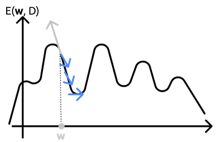

Using the number of miss-classified samples (training loss) as the performance measure result in (due to the fact that the loss value is an integer that represent the number of errors):

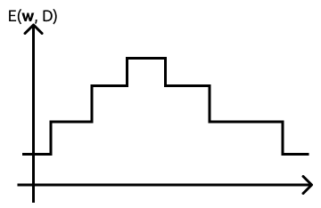

making the grading descent impossible to use (the grading descent needs a smooth error function).

To resolve this problem we use the confidence loss, higher the confidence in the wrong prediction, higher the result in the function: $\displaystyle E(\bold w, D) = \sum_{(\bold x, y)\in D} -yf(\bold x)$.

So if $y$ is positive and $f(\bold x)$ is also positive, the product is positive; if they are both negative the result is positive but if there is an error in the classification the result is negative.

It’s a smooth function because $f(\bold x)$ is a real value; the gradient of this error is: $\displaystyle\nabla E(\bold w, D) = \sum_{(\bold x, y)\in D_E} -y\bold x$

so the update of $\bold w$ at each iteration is $\displaystyle-\eta \nabla E(\bold w, D) = \eta \sum_{(\bold x, y)\in D_E} -y\bold x$ until we reach a zero gradient.

> $\nabla$ = gradient

##### Stochastic training rule

An alternative to the gradient descent, that implies fast updates because with gradient we have to scan the whole training set (because the training error is the sum of them).

We look at just one example, if it’s correct we go to the next sample. When we meet a wrongly classified sample we immediately update the $\bold w$: $\bold w \leftarrow \bold w + \eta y \bold x$

##### Perceptron regression exact solution

Let $X$ be a matrix $\in\R^n \times \R^d$ with $n$ rows, one for each sample ($n = |D|$), and $d$ columns, one for each feature ($d=|\bold x|$).

Let $\bold y\in\R^n$ be the output set.

Linear regression: $X \bold w=\bold y$, solved as $\bold w = X^{-1}\bold y$

But it doesn’t work because $X$ is rectangular, the system of equations is overdetermined and usually an exact solution doesn’t exist.

> overdetermined = more equations than unknown.

To do error minimization we use the mean squared error (the squared error is the difference between $y$ and $f(\bold x)$): $\displaystyle E(\bold w, D) = \sum_{(\bold x, y)\in D}(y - f(\bold x))^2 = (\bold y - X \bold w)^T(\bold y - X \bold w)$

where a closed form solution exists.

We then take the gradient of the error:

$\begin{align*} \nabla E(\bold w, D) = \nabla(\bold y-X\bold w)^T(\bold y - X \bold w)\\
{[\text{we zero it}]}\ =2(\bold y - X\bold w)^T(-X)=0\\
={-2}\bold y^TX + 2\bold w^T X^TX=0\\
{[\text{we transpose everything in order to have }\bold w\text{ as column}]}\ \bold w^T X^TX=\bold y^TX\\
 X^T X\bold w = X^T \bold y\\
 \bold w = (X^T X)^{-1}X^T\bold y\end{align*}$

The $(X^T X)^{-1}X^T$ is called **left-inverse** and exits if $(X^T X) \in \R^{d\times d}$ ($X^TX$ full rank/square).

> linear regression solved as $\bold w = X^{-1}\bold y$, here $X^{-1} =$ left inverse

## “Linear” Multiclass Classification

### One vs All

One binary classification with the boundary between a class and every other class samples.

So you have $m$ decision hyperplanes (one per class) and when you have to make a prediction, you test on all $m$ binary classifier resulting in a confidence for each class and you take the highest confidence.

Boundaries are pieces of hyperplanes, for example between class $i$ and class $j$ is where $f_i(\bold x) = f_j(\bold x) \to \bold w_i^T	\bold x=\bold w^T_j \bold x\to(\bold w_i-\bold w_j)^T=0$

### All pairs

One binary classifier for each class pair.

To predict a new example we see which class wins the highest number of “duels”.

### One-vs-all vs All-pairs

In _one vs all_ you have to train $m$ classifiers, each with all examples. In _all pairs_ you have to train $\displaystyle\frac{m(m-1)}{2}$ classifiers (order of $m^2$ classifiers), but each one only with the examples of the two classes we are training on.

If the complexity of the training procedure is higher than quadratic in the number of examples, _all pairs_ is faster.

## Generative Linear Classifiers

What type of _generative models_ produce _linear classifiers_ with the function they use to discriminate?

**Gaussian classifier**: linear decision boundary are obtained when covariance is shared among classes $\Sigma_i = \Sigma$ (or better, it’s log-linear).

**Naïve Bayes classifier**: $f_i(\bold x)=P(\bold x|y_i)P(y_i)$ 

$\displaystyle=\prod_{j=1}^{|\bold x|}\prod^{K}_{k=1} \theta^{z_k}_{ky_i}(x[j])\frac{|D_i|}{|D|} = \prod^{K}_{k=1} \theta^{N_{k\bold x}}_{ky_i}\frac{|D_i|}{|D|}$

where $|D_i|$ is the dimension of the training set for the class $i$ and $N_{k\bold x}$ is the number of times the feature $k$ appears in $\bold x$; for example in a text $\bold x$, $N$ is the number of times the word $k$ appears.

> $\theta$ is the parameter (?)

This is useful because if I take the $\log$ it becomes $\displaystyle\log f_i(\bold x) = \overbrace{\sum^{K}_{k=1}N_{k\bold x}\log{\theta_{ky_i}}}^{\bold w^T \bold x'}+\overbrace{\log(\frac{|D_i|}{|D|})}^{w_o}$ with:

- $\bold x' = [N_{1\bold x}...N_{K\bold x}]^T$
- $\bold w = [\log{\theta_{1y_i}}...\log{\theta_{Ky_i}}]^T$
- $w_0$ is the bias (since it doesn’t contain any $\bold x$)

The Naïve Bayes is a _log-linear_ model (as Gaussian with shared $\Sigma$)

# Support Vector Machine

## Properties:

- **Large Margin Classifiers**: because when they learn they separate hyperplanes (boundary between classes) and also seprating the classes with  the largest margin.
- the solution (decision boundaries) can be expressed in few training example called support vectors
- the error is based on margin
- can be extended to nonlinear separation with kernel machines

## Maximum margin classifiers

definition of **margin**: given the set $D$, a classifier **confidence margin** is: $\displaystyle\rho = \min_{(\bold x, y)\in D}yf(\bold x)$ [the minimal confidence of the classifier in a correct prediction]

> $yf(\bold x)$ is the confidence in the correct prediction
>
> $f(\bold x)$ is the confidence in the prediction

A classifier **geometric margin** is: $\displaystyle\frac{\rho}{\|\bold w\|} = \min_{(\bold x, y)\in D}\frac{yf(\bold x)}{\|\bold w\|}$

The margin in SVM is the distance between the closest points to the hyperplane.

An hyperplane in general is represented by $\bold w ^T \bold x + w_0 = 0$, with $\overrightarrow {\bold w}$ and $w_0$ are the parameters, and there is an infinite number of equivalent formulation $\forall \alpha\not = 0\to\alpha(\bold w ^T \bold x + w_0)=0$, so we have the same numbers that “zero” it.

So the **canonical hyperplane** is the one having confidence margin $\rho = 1$: $\displaystyle\rho = \min_{(\bold x, y)\in D}yf(\bold x)=1$ and its geometric margin is $\displaystyle\frac{\rho}{\|\bold w\|} =\frac{1}{\|\bold w\|}$

## Hard Margin SVM

**Margin Error Theorem**: $\nu +\sqrt{\displaystyle{\frac cm(\frac{R^2\bigwedge^2}{\rho^2}\ln^2m+\ln(\frac1\delta))}}$

The probability of test error so depends on:

- $\nu$ is number of margin errors (samples that are outside the confidence margin, correcly classified samples with low confidence)

- $m$ training example in the $\displaystyle{\sqrt{\frac{\ln^2 m}{m}}}$ so the result goes down if $m$ goes up

- $R$ is the radius of the space containing all the samples

- larger the margin $\rho$, the smaller test error (so we want the margin $\displaystyle\frac 2{\|\bold w\|}$ to be large)

  if $\rho$ is fixed to 1, maximizing margin corresponds to minimizing $||\bold w||$

- $c$ is a constant

> it makes an upper bound of the generalization error (?)

The name **hard margin** is because we require <u>all</u> examples to be at confidence margin at least one.

### Learning Problem of SVM

we want to minimize the error, so maximizing $\displaystyle{\frac 2 {\|\bold w\|}}$ means minimizing $\displaystyle\frac {\|\bold w\|}2$ and since the square root is monotonic we have to minimize $\displaystyle\frac {\|\bold w\|^2}2 = \frac{\bold w ^T \bold w}2$, so we are interested in finding the minimum $(\overrightarrow{\bold w}, w_0)$.

We can write it as the confidence margin should be grater than one $y_if(\bold x_i)\ge 1$ $\to y_i(\bold w^T\bold x_i+w_0)\ge 1,\ \forall (\bold x_i, y_i)\in D$

### Constrained Optimization

When you do the minimization you have to keep in account the _constraints_

#### Karush-Kuhn-Tucker approach

A constrained optimization problem can be addressed by converting it into an _unconstrained problem_ with the same solution.

e.g. we have to minimize $z$ in $f(z)$ with the constraints $g_i(z)\ge0,\ \forall i$

We introduce a variable $\alpha_i\ge 0$ called Lagrange multiplier for each constraint $i$ and we rewrite the problem as Lagrangian: $\displaystyle\min_z \max_{\alpha\ge0} f(z)-\sum_i \alpha_ig_i(z)$ so it is unconstrained.

We now want to minimize in respect to $z$ and maximize in respect to $\alpha$.

The optimal solutions $z^*$ of this problem are also optimal solution for the starting constrained problem.

Now suppose we find a solution $z'$:

- if at least one constraint is not satisfied ($\exists i\ |\ g_i(z')<0$), maximizing over $\alpha_i$ leads to an infinite value;
- if all constraints are satisfied, maximizing over $\alpha$ sets all elements in the sum to zero so that $z'$ is a solution for $\displaystyle\min_zf(z)$.

If we apply the KKT approach to SVM we have:

$\displaystyle \min_{\bold w, w_o}\quad\frac12\|\bold w\|^2\quad\text{ subject to: }y_i(\bold w^T \bold x_i+w_0)\ge 1,\ \forall (\bold x_i, y_i)\in D$

> $y_i(\bold w^T \bold x_i+w_0)\ge 1$ is the $g_i(z)\ge0$ of the previous example

This **Lagrangian** is minimized with respect to $\bold w$ and maximized with respect to $\alpha$

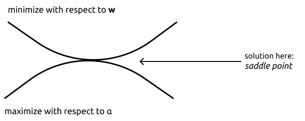

$\displaystyle L(\bold w, w_0, \alpha)=\frac{\|\bold w\|^2}2-\sum^m_{i=1}\alpha_i(y_i(\bold w^T \bold x_i+w_0)-1)$

now we want to minimize with respect to $\bold w, w_0$ and maximize with respect to $\alpha$

So we take $\displaystyle\nabla_\bold w L=\nabla_\bold w \frac{\bold w^T \bold w}{2}-\nabla_\bold w \sum_i \alpha_iy_i\bold w^T \bold x = \frac{\not 2\bold w}{\not 2}-\sum_i \alpha_iy_i \bold x$

and now we set $\displaystyle\bold w-\sum_i \alpha_iy_i \bold x = 0$ getting $\displaystyle\bold w = \sum_i \alpha_iy_i \bold x$, but this is not the solution because $\bold w$ is defined in terms of $\alpha$

So now we make the derivative $\displaystyle\frac{\delta L}{\delta w_0}=\frac{\delta(-\displaystyle\sum_{i}\alpha_iy_iw_0)}{\delta w_0} = -\sum_i\alpha_iy_i = 0\to\sum_i\alpha_iy_i = 0$

> For the full process: **svm 2** lecture 34 minutes in

The result of this **dual formulation** is $\displaystyle\sum^m_{i=1}\alpha_i-\frac12\sum^m_{i,j=1}\alpha_i\alpha_jy_iy_j\bold x^T_i\bold x_j=L(\alpha)$ so we have:
$\displaystyle\max_{\alpha\in\R^m}\quad\sum^m_{i=1}\alpha_i-\frac12\sum^m_{i,j=1}\alpha_i\alpha_jy_iy_j\bold x^T_i\bold x_j$ subject to $\displaystyle\alpha_i\ge0\quad i=1,...,m\quad\sum_{i=1}^m\alpha_iy_i=0$

The **primal variables** are the one in the original problem, this is dual formulation because it contains the $\alpha$ that are the **dual variables** introduced with the _Lagrangian_.

The dual is still a quadratic problem due to the squared $\alpha$.

The result is that $f(\bold x) = \bold w^T \bold x + w_0$ can be written both in form of the primal and of the dual because we know that w is equal to $\displaystyle\bold w = \sum^m_{i=1}\alpha_i y_i \bold x_i$

The decision $f(\bold x)$ (defined as **decision function**) on $\bold x$ is basically taken as a linear combination of dot products between training points and $\bold x$, so if $\bold x_i$ is similar to $\bold x$ it will have a high dot product: <u>each training sample pulls towards its class with a weight that depends on the dot product</u>

In the optimal solution, each component of the lagrange multiplier $\displaystyle\sum^m_{i=1}\alpha_i(y_i(\bold w^T \bold x_i+w_0)-1)$ should be $= 0$, either:

- $\alpha_i = 0$, so the example $\bold x_i$ does not contribute to the final solution
- $y_i(\bold w^T\bold x_i+w_0)=1$, so the confidence for the example should be $1$

The _support vectors_ are where $\alpha_1 >0$ that lays in the hyperplanes where _confidence_ $f(\bold x) = 1$

#### Decision function bias

We can compute the bias $w_0$ by taking any sample $\bold x_i$ where $\alpha >0$ (so any _support vector_), putting it in $y_i(\bold w^T\bold x_i+w_0)=1$ and resolving for $\displaystyle w_0=\frac{1-y_i\bold w^T\bold x _i}{y_i}$

## Soft Margin SVM

There is a _problem_ with hard margin SVM: if two examples are too close, the _margin_ could be too small (and this happens even if there is only one example that moves the decision hyperplane too close), resulting in **overfitting**.

###  Slack variables

To avoid this problem, we go with **soft margin SVM**: we want to maximize the margin and we want all examples to be on their correct side, but this constriction can be _relaxed_ (if there are few examples that are not in the correct side, and ignoring them leads to a higher margin, we can accept it, because is better than overfitting). Formalized as:
$$
\displaystyle \min_{\bold w\in X, w_0\in\R,\xi\in\R^m}\quad \frac12\|\bold w\|^2+C\sum_{i=1}^m\xi_i\\\text{ subject to}\quad y_i(\bold w^T\bold x_i+w_0)\ge1-\xi_i,\quad i=1,...,m\\\xi_i\ge0,\quad i=1,...,m
$$
Where:

- $\xi_i$ is the **slack variable**, it represents the _penalty_ for the sample $\bold x_i$ not satisfying the margin constraint $\to$ larger the $\xi$, further you are from satisfying the constraints
- $C\ge0$ is the **regularization parameter** that trades-off _data fitting_ and _size of the margin_ $\to$ smaller the $C$ more exceptions you can accommodate (you have to decide $C$ before doing the learning task, it’s an hyperparameter)
- the sum of the slacks is minimized together to the inverse margin

> remember: $\displaystyle \min_{\bold w, w_o}\quad\frac12\|\bold w\|^2\quad\text{ subject to: }y_i(\bold w^T \bold x_i+w_0)\ge 1$ part is the hard margin SVM we want to soften

### Regularization Theory

Generalization of the concept written before as: $\displaystyle \min_{\bold w\in X, w_0\in\R,\xi\in\R^m}\quad \frac12\|\bold w\|^2+C\sum_{i=1}^m l(y_i,f(\bold x_i))$

It combines a **complexity term** $\displaystyle \frac12\|\bold w\|^2$ (before it was the _margin_) that shows how complex a model is, the other term $\displaystyle C\sum_{i=1}^m l(y_i,f(\bold x_i))$ refers to **training errors** (_loss function_).

#### Hinge loss

In order to use the _regularization theory_ we have to specify the _loss function_.

In _soft margin SVM_ what we minimize is $\displaystyle\frac12||\bold w||^2+C\sum_{i=1}^m\xi_i$, implying that $\xi_i = l(y_i, f(\bold x_i))$ and the constraint is $y_i(\bold w^T \bold x_i+w_0)\ge 1-\xi_i$ rewritable as $\xi_i \ge 1-y_i(\bold w^T \bold x_i+w_0)$ remembering that $\xi_i\ge0$:
$$
l(y_i, f(\bold x_i)) = |1-y_i(\bold w^T \bold x_i+w_0)|_+\\
|z|_+\text{ means it is} = z \text{ if } z >0, 0 \text{ otherwise}
$$

> $\xi_i = l(y_i, f(\bold x_i))$
>
> $\xi_i$ is the hinge loss
>
> $yf(\bold x)$ is the confidence

$\to$ the loss is $0$ if the confidence in the right prediction is at least $1$,
if it’s less than $1$ the loss is $1 - yf(\bold x)$.

#### Lagrangian and Dual in Soft margin SVM

$\displaystyle L=C\sum^m_{i=1}\xi_i+\frac12||\bold w||^2-\sum^m_{i=1}\alpha_i(y_i(\bold w^T\bold x_i+w_0)-1+\xi_i)-\sum^m_{i=1}\beta_i\xi_i$

$\beta_i$ is the **Lagrange multiplier** for the constraint $\xi_i \ge 0$

$\displaystyle\nabla_w L =\bold w -\sum_i\alpha_i y_i \bold x_i\to\bold w = \sum_i\alpha_i y_i \bold x_i$

So we get: 

- $\displaystyle\frac{\delta L}{\delta w_0}=0\to\sum^m_{\alpha_i, y_i}=0$
- $\displaystyle\frac{\delta L}{\delta \bold w}=0\to\bold w+\sum_{i=1}^m \alpha_i y_i \bold x_i$
- $\displaystyle\frac{\delta L}{\delta \xi_i}=0\to C-\alpha_i-\beta_i=0$

In the end, substituting in the _Lagrangian_ we get: $\displaystyle L(\alpha)=\sum_{i-1}^m\alpha_i-\frac12\sum_{i,j+1}^m\alpha_i\alpha_jy_iy_j\bold x^T_i\bold x_j$

So the **dual formulation** is
$$
\displaystyle \max_{\alpha\in\R^m}\quad \sum_{i-1}^m\alpha_i-\frac12\sum_{i,j=1}^m\alpha_i\alpha_jy_iy_j\bold x^T_i\bold x_j\\
\text{ subject to}\quad 0\le\alpha_i\le C, \quad i=1,...,m\\
\sum_{i=1}^m\alpha_iy_i=0
$$
Different from hard margin SVM because $\alpha$ is upper-bounded by $C$

In the Lagrangian, when we get to the saddle point, the result $\forall i$ is $\alpha_i(y_i(\bold w^T\bold x_i+w_0)-1+\xi_i)=0\\\beta_i\xi_i=0\\C-\alpha_i-\beta_i=0$

thus, _support vectors_ (where $\alpha_i > 0$) are examples for which $y_i(\bold w^T\bold x_i+w_0)\le1$.

Then, let’s suppose $\alpha_i >0$, if $\alpha_i<C$, $\beta_i > 0$ and then of course $\xi_i = 0$: these support vectors are called **unbound SV**, because they stay in the confidence $= 1$ hyperplane ($y_if(\bold x_i) = y_i(\bold w^T\bold x_i+w_0) = 1$)

If $\alpha_i = C$, they are called **bound SV**, and then $\xi_i$ can be greater than zero:  in such case the SV are _margin errors_.

Margin errors can be also _training errors_ if they are in the wrong side of the hyperplane.

## Large-scale SVM

Training of SVM is a quadratic optimization problem; if the dataset is large, to train more quickly there is the **stochastic gradient descent**

We take back the objective of SVM $\displaystyle\frac{\|\bold w\|^2}2+C\sum_{i=1}^m\xi_i = \frac{\|\bold w\|^2}2+C\sum_{i=1}^m|1-y_i(\bold w^T \bold x_i+w_0)|_+$ and changing $\displaystyle\frac mC =\lambda$ we have the _stochastic gradient descent_: $\displaystyle\min_{\bold w \in X}\frac{\lambda}{2}||\bold w||^2+\frac1m\sum_{i=1}^m|1-y_i\langle\bold w,\bold x_i\rangle|_+$

Stochastic means we compute the gradient on a single example at a time: $\displaystyle(\bold x_i, y_i): E(\bold w, (\bold x_i, y_i)) = \frac{\lambda}2\|\bold w\|^2+|1-y_i\langle \bold w, \bold x_i\rangle|_+$

Computing subgradient: when you don’t have gradient in a point (non derivability point), we can still find some gradients
The **subgradient** of a function $f$ at a point $\bold x_0$ is any vector $\bold v$ such that for any $\bold x$ that this holds: $f(\bold x)-f(\bold x_0)\ge \bold v^T(\bold x-\bold x_0)$, it means you can use any of this vector as gradient in points where the derivatives doesn’t exists.

Subgradient on such example = $\nabla_{\bold x}E(\bold w, (\bold x_i, y_i))=\lambda\bold w-\mathbb1[y_1\langle\bold w, \bold x_i\rangle<1]y_i\bold x_i$

> indicator function: $\mathbb1[y_1\langle\bold w, \bold x_i\rangle<1]= \begin{cases}1 &\text{if }y_i\langle\bold w, \bold x_i\rangle <1 \\ 0 &\text{otherwise}\end{cases}$

The algorithm to do the large scale learning is called _Pegasus_:
$$
\bold w_1 = 0\\
\text{for } t=1\text{ to } T:\\
\begin{cases} \text{1. randomly choose } (\bold x_{i_t},y_{i_t}) \text{ from } D\\
\text{2. set } \displaystyle{\eta_t = \frac 1{\lambda t}}\\
\text {3. update } \bold w \text{ with } \bold w_{t+1}=\bold w_t-\eta_t\nabla_{\bold w}E(\bold w, (\bold x_{i_t}, y_{i_t}))
\end{cases}\\
\text{return } \bold w_{T+1}
$$
The _learning rate_ is not static, it’s an **adaptive learning rate** that decreases with $t$: The choice of the learning rate allows to bound the runtime for an $\epsilon$-accurate solution to $\Omicron(d/\lambda\epsilon)$ with $d$ maximum number of non-zero features in an example.

### Extra

#### Dual version

$\displaystyle \bold w_{t+1}=\frac1{\lambda t}\mathbb{1}[y_{i_t}\langle \bold w_t, \bold x_{i_t}\rangle<1]y_{i_t}\bold x_{i_t}$

We can represent $\bold w_{t+1}$ implicitly by storing in vector $\alpha_{t+1}$ the number of times each example was selected and had an on-zero loss, i.e. $\alpha_{t+1}[j] = |\{t'\le t:i_{t’} = j \and y_j\langle\bold w_{t’}, \bold x_j\rangle < 1 \} |$

There is a version of Pegasus for the dual, useful combined with kernels.

# Non-linear Support Vector Machines

So far, hard margin assumes that training examples are linearly separable and separates them with the larger margin.

**Soft margin SVM** allows for exceptions in hard margin.

Non-linear separable problems need a higher expressive power and we don’t want to loose the advantages of linear separators (such as large margin and theoretical guarantees): the solution is to _map_ input examples in a _higher dimensional feature space_ and perform linear classification in this higher dimensional space.

$\phi$ is a **mapping function** mapping each example to a higher dimensional space $\phi : X \to H$ where examples $\bold x$ are replaced with $\phi(\bold x)$; this should _increase the expressive power_ of the representation (creating new features as combinations of input features): examples should be linearly separable in the new mapped space.

> in some cases, the $H$ Hilbert Space can be infinitely dimensional, we will see in future topics

## Polynomial Mapping

The function maps input vector to their **polynomial**, either:

- of a certain degree $d$ (homogeneous mapping) $\to \phi\begin{pmatrix}x\\y\end{pmatrix} = \begin{pmatrix}x^2\\ xy\\ y^2\end{pmatrix}$
- up to a certain degree (inhomogeneous mapping). $\to \phi\begin{pmatrix}x\\y\end{pmatrix} =  \begin{pmatrix}x^2 \\x\\ xy\\ y\\ y^2\end{pmatrix}$ (there is even the degree $1$ other than the degree $2$)

SVM algorithm is applied simply replacing $\bold x$ with $\phi(\bold x)$ in $f(\bold x)\to f(\bold x)=\bold w ^T \phi(\bold x) + w_0$
A <u>linear separation in feature space correspond to a non-linear separation in input space</u>:

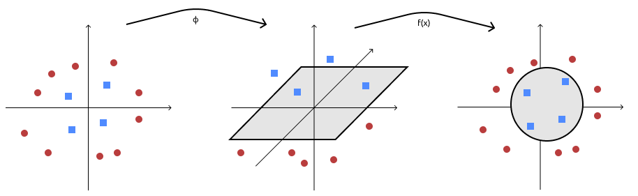

## Support Vector Regression

Non linear SVM used for **regression**: we want to combine and trade of the _fitting of the examples_ and smoothness of the function (_complexity_). 

> mean squared error -> $\displaystyle\frac{|f(\bold x) - y|^2}{m}$
>
> in SVM you don’t pay any cost ONLY if the value is exactly $y$

In regression we want a loss function **more tolerant**, that tolerates small $\epsilon$ deviation from the true value with no penalty:
the $\epsilon$-insensitive loss:
$$
l(f(\bold x, y)) =|y-f(\bold x)|_\epsilon=\begin{cases} 0&\text{if }|y-f(\bold x)|\le\epsilon	\\|y-f(\bold x)|-\epsilon & \text{otherwise}	\end{cases}
$$
if the difference between $y$ and $f(\bold x)$ is within $\epsilon$ ($-\epsilon\le y- f(x)\le \epsilon$) you don’t pay anything; the tolerance is needed because data from measurements or people are almost impossibly perfect.

- Defines an $\epsilon$-tube of insensitiveness around true values.

- $\epsilon$ is an _hyperparameter_, so you have to decide it before the learning/prediction.

This allows to trade off function complexity with data fitting (playing on $\epsilon$ value).

The **optimization problem is**:
$$
\displaystyle
\max_{\bold w\in X, w_0\in\R, \xi,\xi^*\in\R^m}\quad
	\frac{\|\bold w\|^2}2+C\sum_{i=1}^m(\xi_i +\xi^*_i)\\
	
\text{ subject to}\quad \bold w ^T \phi(\bold x_i) + w_0-y_i\le\epsilon+\xi_i\\
	y_i-(\bold w ^T \phi(\bold x_i) + w_0)\le\epsilon+\xi_i^*\\
	\xi_i,\xi^*_i \ge 0
$$
As we can see, there are two constraints for each example for the upper and lower sides of the $\epsilon$-tube.

Slack variables $\xi_i,\xi_i^*$ penalize predictions out of the $\epsilon$-intensive tube.

### Solving with Lagrangian Multiplier (Dual formulation)

Vanishing the derivatives (gradient) with relation to the primal variables we obtain:

$\displaystyle \bold w =\sum^m_{i=1}(\alpha_i-\alpha_i^*)\phi(\bold x_i)$

$\displaystyle \frac{\delta L}{\delta w_0} = 0\to\sum_i(\alpha_i^*-\alpha_i) = 1$

$\displaystyle \frac{\delta L}{\delta \xi_i} = C-\alpha_i-\beta_i=0$

$\displaystyle \frac{\delta L}{\delta \xi_i^*} = C-\alpha_i^*-\beta_i^*=0$

And substituting in the lagrangian we get (after derivatives and semplifications):
$$
\displaystyle \max_{\alpha\in\R^m}\quad 
-\frac12\sum_{i,j=1}^m(\alpha_i^*-\alpha_i)(\alpha_j^*-\alpha_j)\phi(\bold x_i)^T\phi(\bold x_j)
-\epsilon\sum_{i=1}^m(\alpha_i^*+\alpha_i)+\sum_{i=1}^my_i(\alpha_i^*-\alpha_i)
\\
\text{ subject to}\quad 
\sum_{i=1}^m(\alpha_i-\alpha_i^*) = 0\\
\alpha_i,\alpha_i^*\in[0, C]\quad\forall i\in[1,m]
$$

#### Regression function

replacing what we found in the “classification” function, we get: 
$$
\displaystyle
f(\bold x)=\bold w^T\phi(\bold x)+w_0=\sum_{i=1}^m(\alpha_i-\alpha_i^*)\phi(\bold x_i)^T\phi(\bold x)+w_0
$$

> using $\bold x$ instead of $\phi(\bold x)$ it would be linear regression

### Karush-Khun-Tucker conditions 

In terms of support vectors, we have (iconstraints):

- at the saddle point it holds that $\forall i$:
  $$
  \alpha_i(\epsilon+\xi_i+y_i-\bold w^T\phi(\bold x_i)-w_0)=0\\
  \alpha_i^*(\epsilon+\xi_i^*-y_i+\bold w^T\phi(\bold x_i)+w_0)=0\\
  \beta_i\xi_i=0\\
  \beta_i^*\xi_i^*=0
  $$
  
- combining with $C-\alpha_i-\beta_i=0,\quad\alpha_i\ge0,\beta_i\ge0$ and $C-\alpha_i^*-\beta_i^*=0,\quad\alpha_i^*\ge0,\beta_i^*\ge0$

- we get $\alpha_i\in[0, C]\quad\alpha_i^*\in[0, C]$ and $\alpha_i = C\text{ if }\xi_i>0\quad\alpha_i^* = C\text{ if }\xi_i^*>0$

As result we have all examples inside the $\epsilon$-tube ($\alpha_i,\alpha_i^* = 0$) that don’t contribute to the solution (they are **not support vectors**)

Examples for which either $0<\alpha_i<C$ <u>or</u> $0<\alpha_i^* < C$ (they stay on the border) are called **unbound support vectors**

The remaining examples that stay out of the $\epsilon$-insensitive region (out of the tube), in such case they are **bound support vectors** and their $\alpha_i=C$ or $\alpha_i^*=C$

> in the regression you have to stay _inside_ the tube, in classification _outside_ the margin
>
> ma ora che ci penso, cosa cambia tra $\alpha_i$ e $\alpha_i^*$? Si riferiscono a dei vettori particolari?

# Kernel Machines

For learning non-linear models we can apply feature mapping (you have to know _which_ mapping to apply). Even if polynomial mapping is useful, in general it could be _expensive_ to explicitly compute the mapping and deal with a high dimension feature space.

If we look at dual formulation of SVM problem, <u>the feature mapping only appears in dot products</u>.

The **kernel trick** replace the dot product with an equivalent kernel function over the inputs, that produces the output of the dot product but in feature space, without mapping (explicitly) $\bold  x$ and $\bold x’$ to it.

The _dual problem_ of SVM classification becomes:
$$
\displaystyle \max_{\alpha\in\R^m}\quad \sum_{i-1}^m\alpha_i-\frac12\sum_{i,j=1}^m\alpha_i\alpha_jy_iy_j\overbrace{\phi(\bold x_i)^T\phi(\bold x_j)}^{k(\bold x_i, \bold x_j)}\\
\text{ subject to}\quad 0\le\alpha_i\le C, \quad i=1,...,m\\
\sum_{i=1}^m\alpha_iy_i=0
$$
and the _decision function_ becomes : $\displaystyle f(\bold x)=\sum_{i=1}^m\alpha_iy_i\overbrace{\phi(\bold x_i)^t\phi(\bold x)}^{k(\bold x_i, \bold x)}$

## Example in polynomial mapping

- **Homogeneous** polynomial kernel: the same result can be achieved by taking as kernel  $k(\bold x,\bold x')=(\bold x^T\bold x’)^d$ it is the dot product in input space not feature space and the result is a scalar raised to $d$
- **Inhomogeneous** polynomial kernel: $k(\bold x,\bold x')=(1+\bold x^T\bold x’)^d$

> Using as example
> $k(\begin{pmatrix}x_1\\x_2\end{pmatrix}, \begin{pmatrix}x'_1\\x_2'\end{pmatrix}) = (x_1x'_1+x_2x'_2)^2$ and
> $k(\begin{pmatrix}x_1\\x_2\end{pmatrix}, \begin{pmatrix}x'_1\\x_2'\end{pmatrix}) = (1+x_1x'_1+x_2x'_2)$

## Kernel validity

A kernel, if valid, always corresponds to a dot product in some feature space.

A kernel is valid if it’s defined as a _similarity function_ defined as **cartesian product** of input space $k:X\times X\to \R$. It corresponds to a dot product in a certain feature space $k(\bold x, \bold x’) = \phi(\bold x)^T\phi(\bold x’)$

You can compute kernels even with objects that are not vectors, like sequences $\to$ the kernel generalizes the notion of dot product to arbitrary input space 

### Condition for validity

The **Gram matrix** is a _symmetric matrix_ of the kernels between pairs of examples: $K_{ij} = k(\bold x_i, \bold x_j)\quad \forall i, j$

**Positive definite** matrix: a symmetric matrix is positive definite if for any possible vector c $\displaystyle\sum_{i,j=1}^mc_ic_jK_{ij}\ge 0,\quad \forall \bold c \in \R^m$

If equality <u>only</u> holds for $c = 0$, the matrix is **strictly positive definite**

**Alternative definitions**:

- all eigenvalues of $K$ are non-negative
- there exists a matrix $B$ such that $K = B^TB$

#### Validity of Kernel

Conditions for a kernel to be valid:

##### Positive definite kernel

- A positive definite kernel is a function $k: X\times X \to \R$ giving rise to a positive definite _Gram matrix_ for any $m$ and $\{\bold x_1,..., \bold x_m\}$
- positive definiteness is **necessary** and **sufficient** condition for a kernel to correspond to a dot product of some feature map $\phi$

To verify if the kernel is valid, either we have to:

- show how is the $\phi$
- make the _feature map explicit_
- using _kernel combination properties_ (using already valid kernels combined)

In the dual problem for SVM regression, $\phi(\bold x)$ appears only in the dot product (and also in the decision function $\displaystyle
f(\bold x)=\bold w^T\phi(\bold x)+w_0=\sum_{i=1}^m(\alpha_i-\alpha_i^*)\overbrace{\phi(\bold x_i)^T\phi(\bold x)}^{k(\bold x_i, \bold x)}+w_0$):
$$
\displaystyle \max_{\alpha\in\R^m}\quad 
-\frac12\sum_{i,j=1}^m(\alpha_i^*-\alpha_i)(\alpha_j^*-\alpha_j)\overbrace{\phi(\bold x_i)^T\phi(\bold x_j)}^{k(\bold x_i, \bold x_j)}
-\epsilon\sum_{i=1}^m(\alpha_i^*+\alpha_i)+\sum_{i=1}^my_i(\alpha_i^*-\alpha_i)
\\
\text{ subject to}\quad 
\sum_{i=1}^m(\alpha_i-\alpha_i^*) = 0\\
\alpha_i,\alpha_i^*\in[0, C]\quad\forall i\in[1,m]
$$

### Kernelize the Perceptron

- _stochastic perceptron_ (already seen) $f(\bold x) = \bold w^T\bold x$:
  - initialize $\bold w = 0$
  - iterate until all examples are classified correctly $\to$ for each incorrectly classified training example $(\bold x_i, y_i): \bold w \leftarrow \bold w + \eta y_i\bold x_i$
- **kernel perceptron** $\displaystyle f(\bold x) = \sum_{i=1}^m\alpha_ik(\bold x_i,\bold x)$:
  - initialize $\alpha_i = 0\quad\forall i$
  - iterate until all examples are classified correctly $\to$ for each incorrectly classified training example $(\bold x_i, y_i): \alpha_i\leftarrow\alpha_i+ \eta y_i$

$\Rightarrow$ in kernel machines you always have that the decision function is the _sum over the training sample of coefficient times_ $k(\bold x_i, \bold x)$. The coefficient changes depending on the problem.

#### Basic kernels

- **linear kernel** $k(\bold x, \bold x') = \bold x^T\bold x'$: it computes only the dot product: it’s useful when combining kernel because when you don’t have a kernel, in reality you have the linear kernel;
- **polynomial kernel** $k_{d,c}(\bold x, \bold x')=(\bold x^T\bold x'+c)^d$: homogeneous if $c = 0$, inhomogeneous otherwise
- **gaussian kernel** $\displaystyle k_\sigma(\bold x, \bold x')=\exp(-\frac{\|\bold x-\bold x'\|^2}{2\sigma^2}) = \exp(-\frac{\bold x^T\bold x-2\bold x^T\bold x'+\bold x'^T\bold x'}{2\sigma^2})$
  - depends on $\sigma$, the **width** parameter
  - the smaller the width, the more predictions on a point only depends on its nearest neighbours
  - it’s a **universal kernel**: it can uniformly approximate any arbitrary continuous target function (but you first have to find the correct value of $\sigma$)

> Gaussian has infinite dimensional feature space

The **choice** of a Kernel is made **before** training.

## Kernel on structured data

We don’t need to think input as vectors anymore: now the kernel can be seen as a way to _generalize dot products to arbitrary domains_. It’s possible to design kernels over structured objects such as sequences, graphs and trees.

The idea is to create a pairwise function measuring the **similarity between two objects**. This measure has to satisfy the _valid kernel conditions_.

### Examples of Kernel over structure

Every kernel over structure is built as combination of kernels over pieces.

The simplest **kernel over pieces** (of a structure) is the **delta kernel** (or _match_ kernel) $k_\delta(x,x') = \delta(x,x')=\begin{cases}1 &\text{if }x = x'\\0&\text{otherwise}\end{cases}$ where x does <u>not</u> need to be a vector

#### Kernel on sequeces

**Spectrum kernel**: (looking at frequencies of subsequences of $n$ symbols) and the result is the number of time each subsequence appears in the starting sequence. The feature space is the space of all possible $k$-subsequences.

### Kernel Combinations 

Building the kernel combining pieces, provided the basic kernels are valid and the operations are valid, the result is valid.

- **sum**: concatenating the features of the two kernels (that are valid); can be defined on different spaces ($k_1$ and $k_2$ could look at different things):
  $$
  (k_1 + k_2)(x,x') = k_1(x, x')+k_2(x,x')\\
  = \phi_1(x)^T\phi_1(x')+\phi_2(x)^T\phi_2(x')\\
  = (\phi_1(x)\phi_2(x)) \begin{pmatrix}\phi_1(x')\\\phi_2(x')\end{pmatrix}
  $$

- **product**: the resulting feature space is the cartesian product between the feature space of the first kernel and the feature space of the second kernel
  $$
  (k_\times k_1)(x,x') = k_1(x,x')k_2(x,x')\\
  =\sum_{i=1}^n\phi_{1i}(x)\phi_{1i}(x')\sum_{j=1}^m\phi_{2j}(x)\phi_{2j}(x')\\
  =\sum_{i=1}^n\sum_{j=1}^m(\phi_{1i}(x)\phi_{2j}(x))(\phi_{1i}(x')\phi_{2j}(xi))\\
  = \sum_{k=1}^{nm}\phi_{12k} (x)\phi_{12k}(x') = \phi_{12} (x)^T\phi_{12}(x')
  $$
  

  - where $\phi_{12}(x) = \phi_1\times\phi_2$ is the Cartesian product
  - the product can be between kernels in different spaces (**tensor** product)

- **linear combination**: you can always multiply by a positive scalar (if it’s negative the kernel becomes invalid). If I don’t know which kernel to use I just take a bunch of them, combine them linearly and learn the parameters (in addition to learn the $\alpha$s of the dual) $\to$ this is called **kernel learning** 

  - a kernel can be rescaled by an arbitrary positive constant $k_\beta(x,x')=\beta k(x,x')$
  - we can define, for example, linear combinations of kernels (each scaled by a desired weight): $\displaystyle k_{\text{sum}}(x,x') = \sum_{k=1}^k\beta_kk_k(x,x')$

- **normalization**: kernel values can often be influenced by the dimension of objects (a longer string contains more substrings $\to$ higher kernel value). This effect can be reduced with _normalizing_ the kernel.
  **Cosine normalization** computes the cosine of the dot product in feature space: $\displaystyle \hat k(x,x')=\frac{k(x,x')}{\sqrt{k(x,x)k(x',x')}}$

- **composition**: you can combine also by composition
  $$
  (k_{d,c}\ \circ\ k)(x,x')=(k(x,x')+c)^d\\
  (k_\sigma\ \circ\ k)(x,x') = \exp(-\frac{k(x,x)-2k(x,x')+k(x',x')}{2\sigma^2})
  $$
  it corresponds to the composition of the mappings associated with the two kernels.

### Kernel on Graphs

#### Wistfeiler-Lehman graph kernel

It’s an efficient **graph kernel** for large graphs. It relies on (approximation of) Weistfeiler-Lehman test of graph isomorphism and it describes a family of graph kernel:

- Let $\{G_0, G_1, ..., G_h\} = \{(V, E, I_0), (V, E, I_1),...,(V, E, I_h)\}$ be a sequence of graphs made from $G$ where $I_i$ is the node labelling the $i$th WL iteration
- Let $k: G\times G'\to\R$ be any kernel on graphs
- the Weistfeiler-Lehman graph kernel is defined as: $\displaystyle k^h_{WL}(G,G')=\sum_{i=0}^h k (G_i, G_i')$

> Graphs G and H are isomorphic if there is a structure that preserves a one-to-one correspondence between the vertices and edges.

# Unsupervised Learning

Setting:

- supervised learning requires the availability of labelled examples (an extremely expensive process)
- sometimes it is not even known how to label examples
- **unsupervised** techniques can be employed to group examples into **clusters** (groups)

It’s often the first step when looking at some data.

## $k$-means

Simplest approach for _clustering_ is $k$-means; we decide a priori the number of clusters $k$. Each cluster $i$ will be represented by its mean $\mu_i$.

Idea: you want examples to be in cluster with the _closest_ mean.

**Algorithm**:

1. **initialize** the cluster: randomly (for example picking $k$ random examples)
2. iterate until there is **no change in the means**
   - for each example take its nearest mean and assign it to such _cluster_
   - a the end of iteration you compute the _new means_

Usually there is some work to do before (like _normalization_).

## Define the quality of the clusters

### Dissimilarity measures

- (if samples are vectors) Standard Euclidean distance in $\R^d$: $\displaystyle d(\bold x, \bold x')=\sqrt{\sum_{i=1}^d(x_i-x_i')^2}$
- Generic Minkowski metric for $p \ge 1$ (where $p$ is an integer): $\displaystyle d(\bold x, \bold x')=\left(\sum_{i=1}^d|x_i-x_i'|^p\right)^{\frac1p}$
- Cosine similarity (cosine of the angle between vectors): $\displaystyle s(\bold x, \bold x')=\frac{\bold x^T\bold x'}{\|\bold x\|\| \bold x'\|}$

**Metric learning** is important: instead of assuming a predefined metric, you _learn_ it from data (maybe some feature have different weights)

### Sum of squared error criterion

- let $n_i$ be the number of samples in cluster $D_i$

- let $\mu_i$ be the sample mean $\displaystyle \mu_i=\frac{1}{n_i}\sum_{\bold x\in D_i}\bold x$

  $\Rightarrow$ the sum-of-squared error is defined as: $\displaystyle E=\sum_{i=1}^k\sum_{\bold x\in D_i}\|\bold x -\mu_i\|^2$

It measures the squared error incurrent in representing each sample with its cluster mean.

(There are other quality measure)

## Clustering Approach: Gaussian Mixture Model

We decide a priori the number of _clusters_. Each cluster is represented using a Gaussian distribution $\to$ we need to estimate the _mean_ and the _variance_ for each Gaussian.

Problem: if you have data and you have to fit the Gaussian, you should make Maximum-Likelihood of parameters (mean and variance) but you don’t know each example at which gaussian it corresponds; so we adopt the **Expectation-Maximization** approach:

1. Compute _expected cluster_ assignment given the current parameter setting
2. _Estimate parameters_ given the cluster assignment
3. _Iterate_

### Estimating means of k univariate Gaussian

Setting (the latent variable is the cluster assignment):

- A dataset of $x_1, . . . , x_n$ examples is observed
- For each example $x_i$, cluster assignment is modelled as $z_{i1}, . . . , z_{ik}$ binary latent (unknown) variables
- $z_{ij} = 1$ if Gaussian $j$ generated $x_i$, $0$ otherwise [_hot encoding_]
- Parameters to be estimated are the $\mu_1, . . . , \mu_k$ Gaussians means
- All Gaussians are assumed to have the same (known) variance $\sigma^2$

> latent variable = not directly observed but rather inferred (through a mathematical model) from other variables
>
> hot encoding: a vector of $k$ binary variables, $z_{ij} = 1$ if the example $x_i$ came from gaussian $j$, $0$ otherwise (it represent the cluster assigned)

Algorithm:

1. initialize the parameters (as hypothesis) $h = \langle\mu_1,...,\mu_k\rangle$
2. Iterate until the difference in _Maximum Likelihood_ is below a certain threshold:
   - **E-step**: calculate expected value $E[z_{ij}]$ of each latent variable assuming current hypothesis $h = \langle\mu_1, . . . , \mu_k\rangle$ holds
   - **M-step**: calculate a new ML hypothesis $h' = \langle\mu'_1, . . . , \mu'_k\rangle$ assuming values of latent variables are their expected values just computed. Replace $h \leftarrow h'$ (at the end of this step we have a new hypothesis that replaces the current, and repeat)

Computing the algorithm:

- **E-step**: The expected value of $z_{ij}$ is the probability that $x_i$ is generated by Gaussian $j$ assuming hypothesis $h = \langle\mu_1, . . . , \mu_k\rangle$ holds: $\displaystyle E[z_{ij}]=\frac{p(x_i|\mu_j)}{\displaystyle\sum_{l=1}^k p(x_i|\mu_l)} = \frac{\displaystyle	\exp(-\frac{1}{2\sigma^2}[x_i-\mu_j]^2)}{\displaystyle 	\sum_{l=1}^k	\exp(-\frac{1}{2\sigma^2}[x_i-\mu_l]^2)}$
  (the coefficient of the gaussian is absent because is cancelled out with the denominator because it’s constant)
- **M-step**: The maximum-likelihood mean $\mu_j$ is the weighted sample mean, each instance being weighted by its probability of being generated by Gaussian $j$: $\mu'_j=\frac{\displaystyle\sum_{l=1}^n E[z_{ij}]x_i}{\displaystyle\sum_{l=1}^n E[z_{ij}]}$

EM is a general strategy for dealing with _optimization of maximization_ of parameters:

- We are given a dataset made of an observed part $X$ and an unobserved part $Z$
- We wish to estimate the hypothesis maximizing the expected log-likelihood for the data, with expectation taken over unobserved data: $h^*=\text{argmax}_hE_Z[\ln p(X,Z|h)]$

> EM is guaranteed to converge but it could find a local optimum of the likelihood

The unobserved data $Z$ should be treated as random variables that depends on $X$ and $h$

How the generic algorithm works and how it is instantiated in the gaussian mixture model problem: 

- initialize hypothesis $h$

- iterate until convergence:

  - **E-step**: computes the expected likelihood of an hypothesis $h’$ for the full data, where the unobserved data distribution is modelled according to the current hypothesis $h$ and the observed data: $Q(h', h)=E_Z[\ln p(X,Z|h')|h,X]$

    > expected likelihood of $h'$ for the full data, where observed data is the actual observed data, and the unobserved is modelled  according to current hypothesis $h$
    >
    > log lof the likelihood of the data, both observed and unobserved, given the new hypothesis; this likelihood is computed in expectation over Z, and the expectation is computed according to the current versione of hypothesis and the observed data (this configuration is similar to something with bayesian network)

  - **M-step**: replace the current hypothesis with the new one maximizing $Q(h', h)$: $h\leftarrow \text{argmax}_{h'}Q(h',h)$

This is what happens in the case of Gaussian mixture model (derivation):

- the likelihood of an example is: $\displaystyle p(x_i, z_{i1},...,z_{ik}|h')=\frac1{\sqrt{2\pi\sigma}}\exp\left[-\sum_{j=1}^kz_{ij}\frac{(x_i-\mu'_j)^2}{2\sigma^2}\right]$

  > if $z$ is one hot, only the gaussian with 1 will be recovered.
  >
  > The sum is weighted by $z$

- the dataset log-likelihood is: $\displaystyle\ln p(X,Z|h) = \sum_{i=1}^n{\left (\ln\frac{1}{\sqrt{2\pi\sigma}}-\sum_{j=1}^{k}z_{ij}\frac{(x_i-\mu'_j)^2}{2\sigma^2}\right)}$

  > in log, the product becomes a sum

- **E-step**:
  
  - Expectation over $Z$ of $\ln p (X, Z | h’)$ is: $\displaystyle E_Z[\ln p(X,Z|h')]=E_Z\left[\sum_{i=1}^n{\left (\ln\frac{1}{\sqrt{2\pi\sigma}}-\sum_{j=1}^{k}z_{ij}\frac{(x_i-\mu'_j)^2}{2\sigma^2}\right)}	\right]=\\ \sum_{i=1}^n{\left (\ln\frac{1}{\sqrt{2\pi\sigma}}-\sum_{j=1}^{k}E[z_{ij}]\frac{(x_i-\mu'_j)^2}{2\sigma^2}\right)}$
  
    > expectation is a linear operator $\to$ the expectation of two variables is the sum of the two expectations
    >
    > everything that’s not $z$ is a constant in terms of expectation because this is the expectation of $z$
  
  - Using the current version of the hypothesis, expectation is computed as: $\displaystyle E[z_{ij}]=\frac{p(x_i|\mu_j)}{\displaystyle\sum_{l=1}^k p(x_i|\mu_l)}=\frac{\displaystyle\exp-\frac1{2\sigma^2}(x_i-\mu_j)^2}{\displaystyle\sum_{l=1}^k\exp-\frac1{2\sigma^2}(x_i-\mu_l)^2}$
  
    > the expectation is the density for gaussian $j$ normalized over all possible gaussians (the probability that $x_i$ comes from that gaussian)
  
- **M-step**:

  - the maximization over $h’$: $\displaystyle\text{argmax}_{h’}Q(h’,h)=\text{argmax}_{h’}\sum_{i=1}^n{\left (\ln\frac{1}{\sqrt{2\pi\sigma}}-\sum_{j=1}^{k}E[z_{ij}]\frac{(x_i-\mu'_j)^2}{2\sigma^2}\right)}=\\	\text{argmin}_{h'}\sum_{i=1}^n\sum_{j=1}^kE[z_{ij}](x_i-\mu_i')^2 $

    > the first part doesn’t contain $\mu’$ so it’s constant so we can get rid of it. Removing the minus makes it argmin

  - so I zero the derivative and find $\mu'$ $\displaystyle\frac\delta{\delta\mu_j}=-2\sum_{i=1}^nE[z_{ij}](x_i-\mu_j')=0\\\Rightarrow\mu_j'=\frac{\displaystyle \sum_{i=1}^nE[z_{ij}]x_i}{\displaystyle\sum_{i=1}^nE[z_{ij}]}$

## How to choose the number of clusters

Until now we took the number of clusters as given and known in advance, but usually it’s not obvious.

Maybe our knowledge gives us an intuition on the number of clusters, but we can try to find out the number of clusters.

### Elbow method

Very simple method. If we use the _mean squared error_, increasing the number of clusters always decreases the error. We need to **trade-off quality of clusters with quantity** of clusters, so we stop increasing number of clusters when the advantage is limited.

Approach:

1. **Run** clustering algorithm for increasing number of clusters
2. **Plot** the clustering evaluation metric, for different $k$ and we connect the dots
3. Try to see where the curve that is going down has an **elbow**, so when the error starts to be less important and we choose that number of clusters

It’s a bit ambiguous method because the choice is made by eye, or also computing the angle, but there is no formal definition on when to stop.

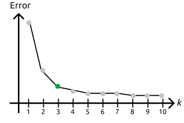

### Average Silhouette

The idea: Increasing the numbers of clusters makes each cluster more homogeneous internally, but also different clusters become more similar. The silhouette method computes this **dissimilarity** between clusters, to _trade-off intra-cluster similarity and inter-cluster dissimilarity_.

#### How it works (for an example $i$):

1. Compute the average dissimilarity between $i$ and examples of _its_ cluster $C$: $\displaystyle a_i = d(i, C)=\frac1{|C|}\sum_{j\in C}d(i, j)$

   > it’s the average distance between $i$ and the examples of its cluster ($j$ is every other example), it’s made for each $i$ - intra cluster similarity

2. Compute the average dissimilarity between $i$ and examples of _each_ cluster $C'\not = C$, and take the minimum: $\displaystyle b_i=\min_{C'\not=C}d(i, C')$

   > inner cluster dissimilarity, min = with the closest cluster

3. The silhouette coefficient is: $s_i=\frac{b_i-a_i}{\max(a_i, b_i)}$

   > the difference between the two values, normalized by the maximum

Then, I run the clustering algorithm up to a certain point, I compute the silhouette for each clustering, I average it over all example and I plot it. I choose $k$ where the average silhouette coefficient is maximal

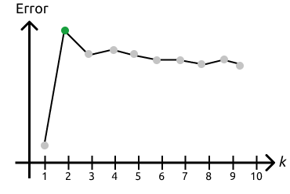

#### Extra

In **Gaussian Mixture Model** there is also another solution based on Bayesian non parametric.

GMM assumes you already know $k$, in Bayesian terms we can combine GMM with the prior on the number of clusters. It computes _for every possible values_ of $k$ and allows you to model options in which GMM can have different number of gaussians and depending on the priori process looks like, it _favours number of gaussians that well fits your data_ combined with a _small number of clusters that it’s embedded with priori_ - It’s Bayesian non-parametric, instead of having parameters, it adds a prior process that automatically adjust the value of parameters

$\to$ **Dirichlet process mixture model**

## Hierarchical clustering

Up to now we took our data and divided them in $k$ clusters (flat). In many situation, data groups have a hierarchy.

A **hierarchy** of clusters can be built in greedy ways:

- **Top-down**:
  1. start with a single cluster with all examples
  2. recursively split clusters into subclusters, accordingly to a certain measure and repeat
- **Bottom up**:
  1. start with $n$ clusters of individual examples (singletons)
  2. recursively aggregate pairs of clusters (the closest groups everytime)

**Dendrogram** (an example of bottom up):

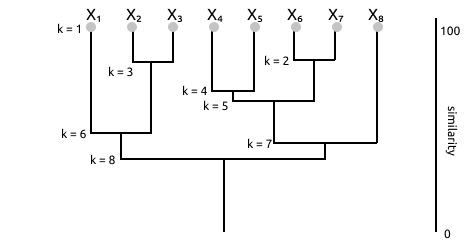

### Agglomerative hierarchical clustering (bottom-up)

Algorithm:

1. Initialize:
   - final number of cluster $k$
   - initial number $\hat k = n$
   - initial clusters $D_i=\{x_i\},\ i \in 1,..., n$
2. while $\hat k > k$:
   - find the pair of closes clusters $D_i, D_j$ (based on some similarity measure)
   - merge those clusters into a single cluster
   - $\hat k = \hat k -1$

You can stop whenever the problem requires.

#### Similarity measures

_Between clusters/sets_

- **Nearest-neighbour**: _minimal distance_ between the elements in the two sets $\displaystyle d_{\min}(D_i, D_j)=\min_{\bold x\in D_i, \bold x'\in D_j}\|\bold x - \bold x'\|$
- **Farthest-neighbour**: _maximal distance_ between the elements in the two sets $\displaystyle d_{\max}(D_i, D_j)=\max_{\bold x\in D_i, \bold x'\in D_j}\|\bold x - \bold x'\|$
- **Average distance**: _average the distances_ between elements in the two sets $\displaystyle d_{\text{avg} }=\frac{1}{n_in_j}\sum_{\bold x\in D_i}\sum_{\bold x'\in D_j}\|\bold x-\bold x'\|$
- **Distance between means**: just the _distance between the two means_ $d_{\text{mean}}(D_i, D_j)=\|\bold \mu_i - \mu_j\|$

$d_{\min}$ and $d_{\max}$ are more sensitive to outliers

$d_{\text{avg}}$ distance can be expensive

### Stepwise optimal hierarchical clustering

It uses some external quality metric.

Algorithm: it’s the same as before (agglomerative hierarchical clustering) but using the external metric for choosing which cluster to merge.

The problem is, that even this approach is greedy.

# Reinforcement Learning

It’s a learning setting, where the learner is an **Agent** that can perform a set of **actions** $A$ depending on its state in a set of **states** $S$ and the environment. In performing action a in state $s$, the learner receive an immediate **reward** $r(s,a)$.

In some states, some actions could be _not possible/valid_.

The task is to **learn a policy** allowing the agent to choose for each state $s$ the action $a$ **maximizing the overall reward**, including future moves.

To deal with this delayed reward problem, the agent has to trade-off _exploitation_ and _exploration_:

- **exploitation** is action it knows give some rewards
- **exploration** experience _alternative_ that could end in bigger reward

This involves also a task called **credit assignment**, to understand which move was responsible for a positive or negative reward. 

> like playing a game and see the win or lose to understand if it was a bad move and in case don’t repeat it

## Sequential Decision Making

Setting:

- An agent needs to take a **sequence of decisions**
- The agent should **maximize** some **utility function**
- There is **uncertainty** in the result of a **decision**: if you take an action, it’s not deterministic that such action brings the agent to a certain state

### Formalization with Markov Decision Process

We have:

- a set of state $S$ in which the agent can be at each instant
- A set of terminal states $S_G \subset S$ (even empty)
- A set of actions $A$ 
- a transition model providing the probability of going to a state $s’$ with action $a$ from state $s$: $P(s’|s,a)\quad s,s’\in S,\ a\in A$
- a reward $R(s, a, s’)$ for making action $a$ in state $s$ which led the agent to state $s’$

### Defining Utilities

We need to **define utilities** in order **to find the policy** for the agent, since it has to _maximize the reward_, and we need to formalize what it is the overall reward (so the utilities over time). We need:

- An **environment history** is a _sequence_ of states, since we are not only interested in immediate rewards but also in delayed rewards 
- **Utilities** are defined over environment histories
- We assume an **infinite horizon** (a priori _no constraint on the number of time steps_)
- We assume **stationary preferences** (if one history is preferred to another at time $t$, the same should hold at time $t’$ provided they start from the same state)

### Utilities over time

Utility is defined over history of states, two simple way to define utilities:

- **Additive rewards**: sum up each reward for each state in the sequence: $U([s_0, s_1, s_2, ...])= R(s_0)+R(s_1)+R(s_2)+...$

  > to make easier, $R(s_n)$ gives the reward of $R(s, a, s_n)$

- **Discounted rewards** $\gamma\in[0,1]$ is a decaying factor: $U([s_0, s_1, s_2, ...])= R(s_0)+\gamma R(s_1)+\gamma^2R(s_2)+...$

### The Policy

A policy $\pi$ is a full specification of _what action_ to take _at each state_.

The utility in a non deterministic setting: expected utility of a policy; is the utility of an environment history, taken in expectation over all possible histories generated with that policy

An **optimal policy** $\pi^*$ is a policy maximizing expected utility (since starting from the same state doesn’t always produce the same state due to the non-deterministic factor)

For infinite horizons, optimal policies are stationary: they only depend on the current state (at a certain state it decide the action based only on the current state)

#### Discussion on optimal policy

- If moving is very _expensive_, optimal policy is to _reach any terminal_ state asap
- If moving is very _cheap_, optimal policy is _avoiding the bad terminal_ state at all costs
- If moving gives _positive reward_, optimal policy is to _stay away from terminal_ states (resulting in never reaching an “exit”, so $\to$ discounted rewards)

 ## Optimal Policy: Utilities

### Utility of a state

Is the expected reward of moving from that state on, and in order to move you need a policy: $\displaystyle U^\pi(s)=E_\pi\left[\sum_{t=0}^\infty \gamma^tR(S_t)|S_0=s\right]$

> Utility of a state $s$ given a certain policy $\pi$ is the Expected reward $E_\pi$

The **true utility** of a state is its utility using the optimal policy: $U(s)=U^{\pi^*}(s)$

Given the _true utility_, an optimal policy is: $\displaystyle\pi^*(s)=\text{argmax}_{a\in A}\sum_{s'\in S}p(s'|s,a)U(s')$

> taking the action that probabilistically brings me to the best possible state, so I sum up over all possible destination states the probability of reaching this destination state, multiplying by the utility of the state
>
> in order to have an optimal policy you also need the transition model

### Computing an Optimal Policy

Formalize the relationship between the utility and policy using the Bellman equation:

$\displaystyle U(s)=R(s)+\gamma\ \max_{a\in A}\sum_{s'\in S}p(s'|s,a)U(s')$

You have one equation for each state, but we don’t know the values of the utilities. The solution are the utilities of the states and are unique, but directly solving the set of equations is hard (non-linearities because of the max).

#### Value iteration

An iterative approach to solve the Bellman equation:

1. initialize $U_o(s)$ to zero for all $s$
2. repeat:
   1. do Bellman update for each state $s$: $\displaystyle U_{i+1}(s)\leftarrow R(s)+\gamma\max_{a\in A}\sum_{s’\in S}p(s’|s,a)U_i(s’)$
   2. $i\leftarrow i+1$
3. until _max utility difference below a threshold_
4. return $U$

$U_0$ is the utility at the zero-th iteration

In the bellman update you use the utility computed before as it was the true utility

You iterate until utilities don’t change more than a threshold

#### Policy iteration

An alternative to value iteration:

1. initialize $\pi_0$ randomly
2. repeat:
   1. policy evaluation, solve set of linear equations: $\displaystyle U_i(s)=R(s)+\gamma\sum_{s'\in S}p(s'|s,\pi_i(s))U_i(s')\quad \forall s\in S$ where $\pi_i(s)$ is the action that policy $\pi_i$ prescribes for state $s$
   2. policy improvement: $\pi_{i+1}(s)\leftarrow\text{argmax}_{a\in A}\displaystyle\sum_{s'\in S}p(s'|s,a)U_i(s')\quad \forall s\in S$
   3. $i\leftarrow i +1$
3. until _no policy improvement_
4. return $\pi$

> $U_i$ is like an approximation

## Dealing with partial knowledge

Until now we assume perfect knowledge of everything (even probability). In most cases some of these information are not known, and those are where reinforcement learning is useful thanks to the exploration part.

Reinforcement learning aims at **learning policies by space exploration**.

**policy evaluation**: policy is given, environment is learned (passive agent)

**policy improvement**: both policy and environment are learned (active agent)

Passive because the agent receives the policy and applies it.

### Policy evaluation in unknown environment

#### Adaptive Dynamic Programming (ADP)

Algorithm (loop):

1. initialize $s$
2. repeat:
   1. Receive reward $r$, set $R(s) = r$
   2. Choose next action $a \leftarrow \pi(s)$
   3. Take action $a$, reach step $s'$
   4. update counts $N_{sa}\leftarrow N_{sa}+1;\quad N_{s'|sa}\leftarrow N_{s'|sa}+1$
   5. update transition model $p(s'|s,a)\leftarrow N_{s''|sa}/N_{sa}\quad \forall s''\in S$
   6. update utility estimate $U\leftarrow \text{PolicyEvaluation}(\pi, U, p, R, \gamma)$
3. until $s$ is terminal

Iterations bring better understanding of the environment in terms of its transitions.

##### Characteristics

The algorithm performs **maximum likelihood estimation of transition probabilities**

Upon updating the transition model, it calls standard policy evaluation to update the utility estimate ($U$ is initially empty)

Each step is _expensive_ as it runs policy evaluation (and the number of steps is huge in order to the agent to learn something)

#### Temporal-difference (TD)

_Approximate_ solution of ADP to reduce the “expensiveness”.

The idea is to avoid running policy evaluation at each iteration, but instead locally update utility:

- If transition from $s$ to $s'$ is observed:

  -  If $s'$ was always the successor of $s$, the utility of $s$ should be $U(s)=R(s)+\gamma U(s')$

  - The temporal-difference update rule updates the utility to get closer to that situation: $U(s)\leftarrow U(s)+\alpha (R(s)+\gamma U(s')-U(s))$

    where $\alpha$ is a learning rate (possibly decreasing over time)

Algorithm (loop):

1. initialize $s$
2. repeat:
   1. Receive reward $r$
   2. Choose next action $a \leftarrow \pi(s)$
   3. Take action $a$, reach step $s'$
   4. Update local utility estimate: $U(s)\leftarrow U(s)+\alpha(r+\gamma U(s') - U(s))$
3. until $s$ is terminal

If the state is new, you “remember” the reward for reaching it.

##### Characteristics

- No need for a transition model for utility update
- Each step is much faster than ADP
- Same as ADP on the long run
- Takes longer to converge
- Can be seen as a rough efficient approximation of ADP

### Policy learning in unknown environment

Modify those algorithms to also learn the policy instead of only evaluating it.

**Policy learning** requires combining _learning the environment_ and _learning the optimal policy_ for the environment: an option is to take ADP and replace the step policy evaluation with policy computation.

There is a problem: The knowledge of the environment is incomplete. A greedy agent usually learns a suboptimal policy (lack of  exploration).

#### Exploration-exploitation trade-off

- Exploitation consists in following promising directions given current knowledge

- Exploration consists in trying novel directions looking for better (unknown) alternatives

- A reasonable trade-off should be used in defining the search scheme:

  - $\epsilon$-greedy strategy: choose a random move with probability $\epsilon$, be greedy otherwise

  - assign higher utility estimates to (relatively) unexplored state-action pairs: $\displaystyle U^+(s)=R(s)+\gamma\max_{a\in A}f\left(\sum_{s'\in S}p(s'|s,a)U^+(s'), N_{sa}\right)$

    with $f$ increasing over the first argument and decreasing over the second.

> probability $1-\epsilon$ is greedy, random with $\epsilon$ probability
>
> higher utility estimate means give a bonus if that state has not been explored much
>
> $N_{sa}$ number of observed state $s$ and took action $a$

It’s common going with solution in which each iteration runs faster.

#### TD

To learn the $<\text{utility of the state}, \text{action}>$ pairs (action utility):

- TD policy evaluation can also be adapted to learn an optimal policy
- If TD is used to learn a state utility function, it needs to estimate a transition model to derive a policy
- TD can instead be applied to learn an action utility function $Q(s, a)$ (I don’t need the transition model, I incorporate it in $Q$)
- The optimal policy corresponds to: $\pi^*(s=\text{argmax}_{a\in A}Q(s,a))$

#### SARSA

The algorithm adapted to _learn an utility-action pair_ is SARSA.

Here I’m updating the utility-action pair so I need to look at the next utility-action pair.

##### SARSA: on-policy TD learning:

1. Initialize $s$
2. Repeat:
   1. Receive reward $r$
   2. Choose next action $a\leftarrow \pi^\epsilon(s)$
   3. Take action $a$, reach step $s’$
   4. Choose action $a’\leftarrow \pi^\epsilon(s’)$ (this point is added in this variant)
   5. Update local utility estimate $Q(s,a)\leftarrow Q(s,a)+\alpha(r+\gamma Q(s', a')-Q(s,a))$
3. Until $s$ is terminal

This is an algorithm that explores the space and finds rewards of new states in within and updates the utility estimate of the state-action pair and it use it in order to find the updated policy. 

#### Q-learning

Another option is to not take another action and take the max current utility action pair function:

##### Q-learning: off-policy TD learning

1. Initialize $s$
2. Repeat:
   1. Receive reward $r$
   2. Choose next action $a\leftarrow \pi^\epsilon(s)$
   3. Take action $a$, reach step $s’$
   4. <s>Choose action $\cancel{a’\leftarrow \pi^\epsilon(s’)}$ (this point is added in this variant)</s>
   5. Update local utility estimate $Q(s,a)\leftarrow Q(s,a)+\alpha(r+\gamma\bold{\text{\bf max}_{a'\in A}} Q(s', a')-Q(s,a))$
3. Until $s$ is terminal

#### SARSA vs Q-learning

- SARSA is **on-policy**: it updates $Q$ using the current policy’s action
- Q-learning is **off-policy**: it updates $Q$ using the greedy policy’s action (which is NOT the policy it uses to search)
- Off-policy methods are _more flexible_: they can even learn from traces generated with an unknown policy
- On-policy methods tend to _converge faster_, and are easier to use for continuous-state spaces and linear function approximators (see following slides)

>  $a’$ is decided according to the current policy. $a’$ is  not an action to do in order to reach a space, but it also used to update $Q$ (? non so da dove sia uscita questa riga)

### Function Approximation

Main aspect of Deep Reinforcement Learning: until now we thought about a tabula representation of utility functions (states or utility-action pairs).

The space grows while you explore it, and sometimes the space could also be continuous.

So you approximate:

- All techniques seen so far assume a **tabular representation** of _utility functions_ (of states or actions)
- Tabular representations do not scale to large state spaces (e.g. Backgammon has an order of $10^{20}$ states)
- The solution is to rely on **function approximation**: approximate $U(s)$ or $Q(s, a)$ with a parameterized function.
- The function takes a state representation as input (e.g. $x,y$ coordinates for the maze)
- The function allows to generalize to **unseen states **(and it allows to compute the utility of states you never saw)

>  It produces the Utility of the state of the utility-action pair

Instead of using a table that for each state gives you a value, you use a function that takes the state represented feature-based and gives the utility multiplied by the weight and the weight are the one to learn.

State utility function approximation: State $s \to \phi(s)$ [_feature vector_] * $\theta$ [_parameter vector_] = **estimated value**

Action utility function approximation:

Q learning: $<state, action> \to$ Q table $\to$ Q-value

Deep Q learning: state $\to$ neural network $\to \begin{cases}Q-\text{value action } 1\\Q-\text{value action } 2\\.\\.\\Q-\text{value action } N\end{cases}$ 

##### How you can do the learning process

If $U$ is a function approximating the table I call it $U_{\theta}$ where $\theta$ are the parameters (so we don’t have the table).

TD learning: state utility

- TD error $\displaystyle E(s,s')+\frac12(R(s)+\gamma U_{\theta}(s')-U_\theta(s))^2$

- Error gradient with respect to function parameters $\nabla_\theta E(s,s')=(R(s)+\gamma U_\theta(s')-U_\theta(s))(-\nabla_\theta U_\theta(s))$

- Stochastic gradient update rule $\theta = \theta-\alpha\nabla_\theta E(s,s')\\=\theta +\alpha(R(s)+\gamma U_\theta(s')-U_\theta(s))(\nabla_\theta U_\theta(s))$

1. the $R(s)+\gamma U_{\theta}(s')$ is what you want your utility to be close to (target), subtracting the current $U_\theta(s)$ (to get the error)

   > squared to penalize more

2. Compute the update step for that utility function with the gradient

3. $\alpha$ is the learning rate

Almost the same on Q-learning: TD learning: action utility (Q-learning):

- TD error $E((s,a),s')+\frac12(R(s)+\gamma\displaystyle\max_{a’\in A}Q_{\theta}(s',a')-Q_{\theta}(s,a))^2$

- Error gradient with respect to function parameters $\nabla_\theta E((s,a),s')=(R(s)+\gamma\displaystyle\max_{a’\in A}Q_{\theta}(s',a')-Q_{\theta}(s,a))(-\nabla_\theta Q_{\theta}(s,a))$

- Stochastic gradient update rule $\theta = \theta-\alpha\nabla_\theta E((s,a),s')\\ =\theta +\alpha\left(R(s)+\gamma \max_{a’\in A}Q_{\theta}(s',a')-\max_{a’\in A}Q_{\theta}(s,a)\right)(\nabla_\theta Q_{\theta}(s,a))$

# Bayesian Networks

BN are probabilistic graphical models.

Probabilistic graphical models are graphical representations of the **qualitative aspects of probability distributions** allowing to:

- visualize the **structure** of a probabilistic model in a simple and intuitive way
- **discover properties** of the model, such as _conditional independencies_, by inspecting the graph
- express **complex computations for inference** and learning in terms of graphical manipulations
- represent multiple probability distributions with the same graph, abstracting from their quantitative aspects (e.g. discrete vs continuous distributions)

The structure is a directed acyclic graph $G$. Each **node** represent a **random variable**, each **edge** represent a **direct relationship** between variables.

The structure encodes these independence assumptions: $I_l(G)=\{\forall i\ x_i\perp \text{NonDescendants}_{x_i}|\text{Parents}_{x_i}\}$

$\perp$ means **independent** (from its non descendants given its parents)

Distributions: suppose this variable have a probabilistic relationship between them.

- Let $p$ be a joint distribution over variables $X$

- $I(p)$ is the set of independence that hold in $p$ (aka in the distribution)
- $G$ is an **independency map** (**I-map**) for $p$ if $p$ satisfies the local independences in $G$: $I_l(G)\subseteq I(p)$

The probability can be decomposed according to graph, we say that $p$ factorizes according to $G$ if $\displaystyle p(x_1, ..., x_m)=\prod_{i=1}^mp(x_i|Pa_{x_i})$ where $Pa_{x_i}$ are the parents of $x_i$

And we know that If $G$ is an I-map for $p$, then $p$ factorizes according to $G$ and vice versa, If $p$ factorizes according to $G$, then $G$ is an I-map for $p$.

> Why do we want to factorize? Suppose we want to model a joint distribution over $m$ (binary) variables. We get $2^m$ configurations. To deal with this huge model we factorize.

## Bayesian Networks

A Bayesian Network is a pair $(G, p)$ where $p$ factorizes over $G$ (a DAG) and it is represented as a set of _conditional probability distributions_ (cpd) associated with the nodes of $G$

Factorized Probability: $\displaystyle p(x_1, ..., x_m)=\prod_{i=1}^mp(x_i|Pa_{x_i})$

Each of the pieces of the product is a _conditional probability distribution_.

## Conditional independence

introduction:

- Two variables $a, b$ are **independent** (written $a\perp b | \O$) if: $p(a, b) = p(a)p(b)$
- Two variables $a, b$ are **conditionally independent** given $c$ (written $a\perp b | c$ ) if: $p(a, b|c) = p(a|c)p(b|c)$
- Independence assumptions can be verified by **repeated applications of sum and product rules**
- Graphical models allow to directly verify them through the **d-separation criterion**

#1 doesn’t imply #2

> Sum rule: $\displaystyle p(a) = \sum_b p(a, b)$
>
> product rule: $p(a,b) = p(a|b)p(b)$
>
> Bayes rule: $\displaystyle p(a,b) = p(a|b)p(b) = p(a|b)p(b) \Rightarrow p(a|b) = \frac{p(b|a)p(a)}{p(b)}$
>
> Independency in network can be verify by applying those rules and visually inspecting the network if know what to watch

### d- separation

#### Tail to Tail

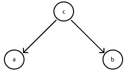

- Joint distribution: $p(a, b, c) = p(a|c)p(b|c)p(c)$
- $a$ and $b$ are **not independent** (written $a \top\top b | \O$ ): $p(a,b)=\displaystyle\sum_cp(a|c)p(b|c)p(c)\neq p(a)p(b)$
- (is if $c$ is observed) $a$ and $b$ are **conditionally independent** given $c$: $\displaystyle p(a,b|c)=\frac{p(a,b,c)}{p(c)}=p(a|c)p(b|c)$
- $c$ is tail-to-tail with respect to to the path $a\to b$ as it is connected to the tails of the two arrows

$c$ is connected by tails to the other two (the other are the head)

$a$ and $b$ are not independent 

> think about $c$ = flu, $a$ = fever and $b$ = cough; if $a = 1$, it increase the possibility of $b=1$

#### Head to tail

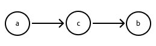

- Joint distribution: $p(a, b, c) = p(b|c)p(c|a)p(a)=p(b|c)p(a|c)p(c)$
- $a$ and $b$ are **not independent**: $p(a,b)=p(a)\displaystyle\sum_cp(b|c)p(c|a)\neq p(a)p(b)$
- (is if c is observed) $a$ and $b$ are **conditionally independent** given $c$: $\displaystyle p(a,b|c)=\frac{p(b|c)p(a|c)p(c)}{p(c)}=p(b|c)p(a|c)$
- $c$ is head-to-tail with respect to to the path $a\to b$ as it is connected to the head of an arrow and to the tail of the other one

#### Head to head

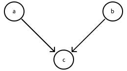

- Joint distribution: $p(a, b, c) = p(c|a,b)p(a)p(b)$
- $a$ and $b$ are **independent**: $p(a,b)=\displaystyle\sum_cp(c|a,b)p(a)p(b) =p(a)p(b)$
- (is if $c$ is observed) $a$ and $b$ are **not conditionally independent** given $c$: $\displaystyle p(a,b|c)=\frac{p(c|a,b)p(a)p(b)}{p(c)}\neq p(a|c)p(b|c)$
- $c$ is head-to-head with respect to to the path $a\to b$ as it is connected to the heads of the two arrows

> $a$ burglar, $b$ earthquake, $c$ alarm: $a$ and $b$ become dependent if $c$ observed (if alarm started and there is a earthquake, the burglar becomes less probable)

##### General Head to Head

- Let a descendant of a node $x$ be any node which can be reached from $x$ with a path following the direction of the arrows
- A head-to-head node $c$ unblocks the dependency path between its parents if either itself or any of its descendants receives evidence

#### d-separation: basic rules summary

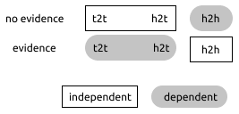

### d-separation criterion

D-separation definition:

- Given a generic Bayesian network
- Given $A$, $B$, $C$ arbitrary nonintersecting sets of nodes
- The sets $A$ and $B$ are _d-separated_ by $C$ ($\text{dsep}(A; B|C)$) if: all paths from any node in $A$ to any node in $B$ are blocked
- A **path is blocked** if it includes at least one node s.t. either:
  - the arrows on the path meet _tail-to-tail_ or _head-to-tail_ at the node and it is in $C$, or
  - the arrows on the path meet _head-to-head_ at the node and neither it nor any of its descendants is in $C$

d-separation implies conditional independence: The sets $A$ and $B$ are independent given $C ( A \perp B | C )$ if they are d-separated by $C$.

Examples:

- $a \top\top b|c$: Nodes $a$ and $b$ are not d-separated by $c$ (between $a$ and $b$ there is not $c$):

  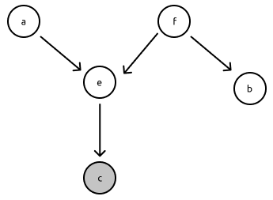

  - Node f is _tail-to-tail_ and not observed
  - Node e is _head-to-head_ and its child $c$ is observed

- $a \perp b|f$: Nodes $a$ and $b$ are d-separated by $f$ (between $a$ and $b$ there is $f$):

  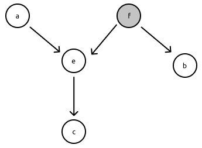

  - Node $f$ is _tail-to-tail_ and observed
  - $\to$ $f$ observed blocks the flow

## BN independeces revisited

Any pairs of sets that it’s separated by another set is an independence.

A BN structure $G$ encodes a set of global (**Markov**) **independence assumptions**: $I(G) = {(A \perp B|C) : \text{dsep}(A; B|C)}$

## BN equivalence classes

Different BN can encode the same independencies.

All of this say that $A$ and $B$ are independent and become dependent if $C$ is observed:

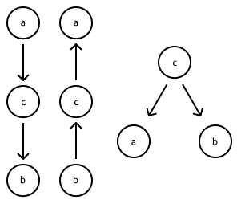

When you try to model a distribution using a BN you try to encode independencies in the distribution and your graphical model has to be an I-map for $p$.

The number of independency can make the network more or less connected, and if we connect each pair of variables then we are coding _no independency_ and you are _not saving any computation_ even if it’s a _valid model_ for any distribution.

So, we want a network as sparse as possible with less as few edges as possible.

**Minimal I-maps**:

- For a structure $G$ to be an I-map for $p$, it does not need to encode all its independences (e.g. a fully connected graph is an I-map of any $p$ defined over its variables)
- A minimal I-map for p is an I-map $G$ which can’t be “reduced” into a $G_0 \subset G$ (by removing edges) that is also an I-map for $p$.

Problem: A minimal I-map for $p$ does not necessarily capture all the independences in $p$.

> You can’t remove any edge

And a **perfect map** encodes all and only the independency in a distribution:

- A structure $G$ is a perfect map (**P-map**) for p if it captures all (and only) its independences: $I(G) = I(p)$
- There exists an algorithm for finding a P-map of a distribution which is exponential in the in-degree of the P-map
- The algorithm returns an **equivalence class** rather than a single structure

_Problem_: Not all distributions have a P-map. Some cannot be modelled exactly by the BN formalism.

## Build a BN

Because we want to model a probabilistically uncertain domain. Suggestions:

- Get together with a domain expert
- Define variables for entities that can be observed or that you can be interested in predicting (latent variables can also be sometimes useful)
- Try following causality considerations in adding edges (more interpretable and sparser networks)
- In defining probabilities for configurations (almost) never assign zero probabilities
- If data are available, use them to help in learning parameters and structure

# Learning in Graphical Models

Let’s start with the model given:

- We are given a dataset of examples (**training set**) $D = \{\bold x(1), . . . , \bold x(N)\}$

- each example $\bold x(i)$ is a configuration for the variables in the network. If it’s a configuration with every variable is complete, else is incomplete (missing data)

We need to **estimate the parameters** of the model (conditional probability distributions) from the data: the simplest approach consists of learning the parameters _maximizing the likelihood_ of the data: $\theta^{\max} = \text{argmax}_\theta p(D|\theta) = \text{argmax}_\theta L(D, \theta)$ $\to$ we maximize the probability of the example given the parameter, and the likelihood of the data given the parameters.

## ML estimation with complete data

I want to write down the entire relationship between the data and the parameters. $\displaystyle p(D|\theta) = \prod_{i=1}^N p(\bold x (i)|\theta)\\ $ with the examples independent given $\theta$. We can write the probability associated to the example as $\displaystyle \prod_{i=1}^N\prod_{j=1}^m p(\bold x_j(i)|\text{Pa}_j(i),\theta)$ with the factorization for Bayesian Network.

Each instance of the BN is related to a different example. The parameters can be themselves decomposed with disjoint CPD parameters $\displaystyle \prod_{i=1}^N\prod_{j=1}^m p(\bold x_j(i)|\text{pa}_j(i),\theta_{X_j|\text{Pa}_j})$

> Conditional Probability Distribution

The parameters of each CPD can be estimated independently: $\theta_{X_j|\text{Pa}_j}^\max=\text{argmax}_{\theta_{X_j|\text{Pa}_j}}\displaystyle \overbrace{\prod_{i=1}^Np(\bold x_j(i)|\text{pa}_j(i),\theta_{X_j|\text{Pa}_j})}^{L(\theta_{X_j|\text{Pa}_j}, D)}$

A discrete CPD $P(X|\bold U)$, can be represented as a **table**, with:

- a **number of rows** equal to the number $\text{Val}(X)$ of configurations for $X$
- a **number of columns** equal to the number $\text{Val}(\bold U)$ of configurations for its parents $\bold U$
- each table entry $\theta_{x|\bold u}$ indicating the probability of a specific configuration of $X = x$ and its parents $\bold U = \bold u$

> $j$ is independent, all nodes are treated independently, so it’s just “any node”

Replacing $p(x(i)|\text{pa}(i))$ with $\theta_{x(i)|\bold u(i)}$ , the local likelihood of a single CPD becomes:
$$
L(\theta_{X|\text{Pa}}, D)=\prod_{i=1}^N p(x(i)|\text{pa}(i), \theta_{X|\text{Pa}_j})\\
= \prod_{i=1}^N \theta_{x(i)|\bold u(i)}\\
= \prod _{\bold u\in\text{Val}\bold (U)}\left[\prod_{x\in\text{Val}(X)}\theta_{x|\bold u}^{N_{\bold u, x }}\right]
$$
where $N_{\bold u, x }$ is the number of times the specific configuration $X = x$, $\bold U = \bold u$ was found in the data.

A column in the CPD table contains a multinomial distribution over values of $X$ for a certain configuration of the parents $\bold U$.

Thus _each column should sum to one_: $\displaystyle\sum_x\theta_{x|\bold u}=1$

Parameters of different columns can be estimated independently.

For each multinomial distribution, zeroing the gradient of the maximum likelihood and considering the normalization constraint, we obtain: $\displaystyle \theta^{\max}_{x|\bold u}=\frac{N_{\bold u, x}}{\displaystyle \sum_x N_{\bold u, x}}$

The maximum likelihood parameters are simply the fraction of times in which the specific configuration was observed in the data.

The _result_ will be: what is the prob of a parameter? The fraction of time we see such parameter.

## Introducing priors  (MAP)

Means modelling the **posterior distribution** of the parameters given the data, **maximizing** it instead of the likelihood.

ML estimation tends to _overfit_ the training set.

Configuration _not_ appearing in the training set will receive _zero probability_: a common approach consists of combining ML with a prior probability on the parameters, achieving a **maximum-a-posteriori** estimate: $\theta^{\max}=\text{argmax}_\theta p (D|\theta)p(\theta)$ and maximizing $p(D|\theta)p(\theta)$ is the same as maximizing $p(\theta|D)$ because $p(D)$ is a constant, so if I maximize this, I maximize the posterior of the parameters given the data.

### Dirichlet priors

The natural prior for a multinomial distribution is a Dirichlet distribution with parameters $\alpha_{x|u}$ for each possible value of $x$.

The resulting maximum-a-posteriori estimate is: $\displaystyle \theta^{\max}_{x|\bold u}=\frac{N_{\bold u, x}+\alpha_{x|\bold u}}{\displaystyle \sum_x (N_{\bold u, x}+\alpha_{x|\bold u})}$

The prior is like having observed $\alpha_{x|\bold u}$ imaginary samples with configuration $X = x, U = u$

$\alpha_{x|\bold u}$ are virtual counts of imaginary samples, considering also what there is in the prior (that can be a set of imaginary samples)

It’s like computing **frequencies of configurations**, but with incomplete data we cannot compute the counts. 

## Incomplete data and EM for Bayesian nets

The full Bayesian approach of integrating over missing variables is often intractable in practice (summing up all alternatives possible will be expensive).

We need approximate methods to deal with the problem: we try to estimate a missing value (with the probability) given what we know, resulting in the probability of each value the missing one could become, and it will contribute with a certain fraction to some configuration and with a certain fraction in another. We use this probabilities to generate **expected counts** (probabilistic).

We now compute parameters maximizing likelihood (or posterior) with such expected counts and we iterate, improving the quality of these parameters. We iterate to improve quality of parameters (it converges to a local maximum of the likelihood)

Algorithm:

- **e-step**: Compute the expected sufficient statistics for the complete dataset, with expectation taken with respect to the joint distribution for $\bold X$ conditioned of the current value of $\theta$ and the known data $D$: $E_{p(\bold X|D,\theta)}[N_{ijk}]=\displaystyle\sum_{l=1}^n p(X_i(l)=x_k,\text{Pa}_i(l)=\text{pa}_j|\bold X_l,\theta)$
  - If $X_i(l)$ and $\text{Pa}_i(l)$ are observed for $\bold X_l$ , it is either zero or one
  - Otherwise, run Bayesian inference to compute probabilities from observed variables

$N_{ijk}$ is the number of counts for the configuration where $x_i$ takes the value $x_k$ and the parents of $i$ takes the value of the parents of $j$: 

- $i$ is the node in the network
- $k$ is the value for that node
- $j$ is the value of the parents
- is the $l$-th example
- $X_l$ is what I know of the $l$-th example

> $i$ identifies the table and $j,k$ the coordinates in the table

If $X_l$ is observed there is no need to do inferences, just use $0$ or $1$

- **m-step**: compute parameters maximizing likelihood of the complete dataset $D_c$ (using expected counts): $\theta^*=\text{argmax}_\theta p(D_c|\theta)$, which for each multinomial parameter evaluates to: $\theta_{ijk}^*=\displaystyle\frac{E_{p(\bold X|D,\theta)}[N_{ijk}]}{\displaystyle \sum_{k=1}^{r_i}E_{p(\bold X|D,\theta)}[N_{ijk}]}$

  > $r_i$ is the row (of the table) we are working on

$D_c$ is the dataset filled with expected counts.

Note: ML estimation can be replaced by _maximum a-posteriori_ (MAP) estimation giving: $\theta_{ijk}^*=\displaystyle\frac{\alpha_{ijk}+E_{p(\bold X|D,\theta)}[N_{ijk}]}{\displaystyle \sum_{k=1}^{r_i}\left(\alpha_{ijk}+E_{p(\bold X|D,\theta)}[N_{ijk}]\right)}$

---

Until now the structure was given, but what if we need to **learn the structure**?

- **constraint-based**: test conditional independencies on the data and construct a model satisfying them
- **score-based**: assign a score to each possible structure, define a search procedure looking for the structure maximizing the score
- **model-averaging**: assign a prior probability to each structure, and average prediction over all possible structures weighted by their probabilities (full Bayesian, intractable)

_score-based_ is not monotonic

> Learning the structure model averaging is very complex because the number of structures is exponential in the number of variables

# Naïve Bayes

_based only on the slides, no lecture found_

## Naïve Bayes Classifier

The setting:

- each instance $x$ is described by a conjunction of attribute values $\langle a_1,...,a_m\rangle$
- the target function can take any value from a finite set $Y$
- the task is to predict the MAP target value given the instance:
   $y^*=\text{argmax}_{y_i\in Y}P(y_i|x) =\\\text{argmax}_{y_i\in Y}\displaystyle\frac{P(a_i,...,a_m|y_i)P(y_i)}{P(a_i,...,a_m)}=\\\text{argmax}_{y_i\in Y}P(a_i,...,a_m|y_i)P(y_i)$

> argmax is a mathematical function that you may encounter in applied machine learning. It’s an operation that finds the argument that gives the maximum value from a target function.

## Assumption

The **learning problem**: Class conditional probabilities $P(a_1, . . . , a_m|y_i)$ are hard to learn, as the number of terms is equal to the number of possible instances times the number of target values.

### Simplifying assumption

1. **attribute** values are assumed **independent** of each other given the target value: $P(a_1, ..., a_m|y_i)=\displaystyle\prod_{j=1}^m P(a_j|y_i)$
2. **Parameters** to be learned **reduced** to the number of possible attribute values times the number of possible target values

## Classifier

Definition: $y^*=\text{argmax}_{y_i\in Y}\displaystyle\prod_{j=1}^mP(a_j|y_i)Py(y_i)$

### Single distribution case

We assume all attribute values come from the same distribution $\to$ the probability of an attribute value given the class can be modelled as a multinomial distribution over the $K$ possible values: $P(a_j|y_i)=\displaystyle\sum_{k=1}^K\theta_{ky_i}^{z_k(a_j)}$

### Parameters learning

Target priors $P(y_i)$ can be learned as the fraction of training set instances having each target value $\to$ the maximum-likelihood estimate for the parameter $\theta_{kc}$ (probability of value $v_k$ given class $c$) is the fraction of times the value was observed in training examples of class $c$: $\theta_{kc}=\displaystyle\frac{N_{kc}}{N_c}$

Assume a Dirichlet prior distribution (with parameters $\alpha_{1c}, . . . , \alpha_{Kc}$) for attribute parameters; the posterior distribution for attribute parameters is again multinomial: $\theta_{kc}=\displaystyle\frac{N_{kc}+\alpha_{kc}}{N_c+\alpha_c}$

### Example: text classification

#### task description

the task is to classify documents in one of $C$ possible classes. Each document is represented as the bag-of-words it contains (no position). Let $V$ be the vocabulary of all possible words. A dataset of labelled documents $D$ is available.

#### learning

1. compute prior probs of classes as $P(y_i)=\displaystyle\frac{D_i}D$ where $D_i$ is the subset of training examples with class $y_i$
2. model attributes with a multinomial distribution with $K=|V|$ possible states (words)
3. compute the probability of the word $w_k$ given the class $c$ as the fraction of times the word appears in documents of class $y_i$, with respect to all words in documents of class $c$: $\theta_{kc}=\displaystyle\frac{\displaystyle\sum_{\bold x\in D_c}\sum_{j=1}^{|\bold x|}z_k(x[j])}{\displaystyle\sum_{\bold x\in D_c}|\bold x|}$

#### classification

$\displaystyle y^*=\text{argmax}_{y_i\in Y}\prod_{j=1}^{|\bold x|}P(x[j],y_i)P(y_i)=\\\text{argmax}_{y_i\in Y}\prod_{j=1}^{|\bold x|}\prod_{k=1}^K\theta_{ky_i}^{z_k(x[j])}\frac{|D_i|}{|D|}$

#### notes

We are making the simplifying assumption that all attribute values come from the same distribution, otherwise attributes from different distributions have to be considered separately for parameter estimation.

# Maximum-likelihood and Bayesian parameter estimation

_based only on the slides, no lecture found_

Setting:

- Data are sampled from a **probability distribution** $p(x, y)$
- The form of the probability distribution $p$ is known but its _parameters_ are _unknown_
- There is a **training set** $D = \{( x_1, y_1), . . . , (x_m, y_m)\}$ of examples sampled i.i.d. according to $p(x, y)$

> **iid** = independent and identically distributed, each variable has the same probability distribution as the others and they are all independent

Task: Estimate the unknown parameters of $p$ from training data $D$.

## Multiclass classification setting:

- The training set can be divided into $D_1, . . . , D_c$ subsets, one for each class (e.g. $D_i = \{\bold x_1, . . . , \bold x_n\}$ contains i.i.d examples for target class $y_i$)
- For any new example $\bold x$ (<u>not</u> in training set), we compute the **posterior probability** of the class given the example and the full training set $D$: $P(y_i|\bold x, D)=\displaystyle\frac{p(\bold x|y_i, D)p(y_i|D)}{p(\bold x|D)}$

> Bayesian decision theory: compute posterior probability of class given example

### Setting simplifications

- we assume $\bold x$ is independent of $D_j(j\not = i)$ given $y_i$ and $D_i$
- without additional knowledge, $p(y_i|D)$ can be computed as the fraction of examples with that class in the dataset
- the normalizing factor $p(\bold x|D)$ can be computed marginalizing $p(\bold x|y_i, D_i)p(y_i|D)$ over possible classes

$\Rightarrow$ We must **estimate class-dependent parameters** $\theta_i$ for $p(\bold x|y_i, D_i)$

## Maximum Likelihood vs Bayesian Estimation

### Maximum Likelihood/Maximum a-posteriori estimation

It assumes _parameters_ $\theta_i$ have _fixed but unknown_ values; values are computed as those **maximizing** the probability of the observed examples $D_i$ (the training set for the class). Obtained values are used to compute probability for new examples: $p(\bold x|y_i, D_i) \approx p(\bold x|\theta_i)$

### Bayesian Estimation

It assumes parameters $\theta_i$ are random variables with some **known prior distribution**; _observing examples_ turns prior distribution over parameters into a **posterior distribution**. Predictions for new examples are obtained integrating over all possible values for the parameters: $p(\bold x|y_i,D_i)=\displaystyle\int_{\theta_i}p(\bold x, \theta_i|y_i,D_i)d\theta_i$

## Maximum Likelihood

### Maximum a-posteriori estimation

$\theta_i^*=\text{argmax}_{\theta_i}\ p(\theta_i|D_i,y_i)=\text{argmax}_{\theta_i}\ p(D_i, y_i|\theta_i)p(\theta_i)$

It assumes a **prior distribution** for the parameters $p(\theta_i)$ is **available**.

### Maximum likelihood estimation

$\theta_i^*=\text{argmax}_{\theta_i}\ p(D_i,y_i|\theta_i)$

It **maximizes the likelihood** of the **parameters** with respect to the training samples.

<u>No</u> assumption about prior distributions for parameters.

#### Setting

- A **training data** $D = \{\bold x_1, . . . , \bold x_n\}$ of i.i.d. examples for the target class $y$ is available
- We assume the **parameter vector** $\theta$ has a **fixed but unknown** value
- We estimate such value _maximizing its likelihood_ with respect to the training data: $\theta^*=\text{argmax}_{\theta}\ p(D|\theta)=\text{argmax}_\theta\displaystyle\prod_{j=1}^np(\bold x_j, \theta)$
- The joint **probability** over $D$ decomposes **into a product** as examples are i.i.d (thus independent of each other given the distribution)

#### Maximizing log-likelihood

It is usually simpler to maximize the _logarithm_ of the likelihood (monotonic): $\theta^*=\text{argmax}_\theta\ln p(D|\theta)=\text{argmax}_\theta\displaystyle\sum_{j=1}^n \ln p(\bold x_j|\theta)$

> Monotonic = preserves the order

Necessary conditions for the maximum can be obtained zeroing the gradient with respect to $\theta$: $\nabla_\theta\displaystyle\sum_{j=1}^n\ln p(\bold x_j|\theta)=0$ (points zeroing the gradient can be local or global maxima depending on the form of the distribution)

#### Univariate Gaussian case: unknown $\mu$ and $\sigma^2$

The **log-likelihood** is: $\displaystyle L=\sum_{j=1}^n-\frac1{2\sigma^2}(x_j-\mu)^2-\frac12\ln 2\pi\sigma^2$

The _gradient_ with respect to $\mu$ is: $\displaystyle \frac{\delta L}{\delta \mu} = 2\sum_{j=1}^n-\frac{1}{2\sigma^2}(x_j-\mu)(-1)=\sum_{j=1}^n\frac{1}{\sigma^2}(x_j-\mu)$

Setting the **gradient to zero** gives **mean**: 
$$
\sum_{j=1}^n\frac{1}{\sigma^2}(x_j-\mu) = 0\\
\sum_{j=1}^n(x_j-\mu)=0\\
\sum_{j=1}^nx_j=\sum_{j=1}^n\mu\\
\sum_{j=1}^nx_j=n\mu\\
\mu = \frac1n \sum_{j=1}^nx_j
$$
The _gradient_ with respect to $\sigma^2$ is: $\displaystyle \frac{\delta L}{\delta \sigma^2} = \sum_{j=1}^n-(x_j-\mu)^2\frac\delta{\delta\sigma^2}\frac1{2\sigma^2}-\frac12\frac1{2\pi\sigma^2}2\pi\\=\sum_{j=1}^n-(x_j-\mu)^2\frac12(-1)\frac1{\sigma^4}-\frac1{2\sigma^2}$

Setting the **gradient to zero** gives **variance**:
$$
\sum_{j=1}^n\frac1{2\sigma^2}=\sum_{j=1}^n\frac{(x_j-\mu)^2}{2\sigma^4}\\
\sum_{j=1}^n\sigma^2=\sum_{j=1}^n(x_j-\mu)^2\\
\sigma^2=\frac1n\sum_{j=1}^n(x_j-\mu)^2
$$

#### Multivariate Gaussian case: unknown $\mu$ and $\Sigma$

The **log-likelihood** is: $\displaystyle\sum_{j=1}^n-\frac12(\bold x_j-\mu)^t\Sigma^{-1}(\bold x_j-\mu)-\frac12\ln(2\pi)^d|\Sigma|$

The **maximum-likelihood estimates** are: $\displaystyle \mu=\frac12\sum_{j=1}^n\bold x_j$ 

and: $\displaystyle \Sigma =\frac1n \sum_{j=1}^n(\bold x_j-\mu)(\bold x_j-\mu)^t$

#### General Gaussian case

**Maximum likelihood estimates** for Gaussian parameters are simply **their empirical estimates** over the samples:

- _Gaussian mean_ is the _sample mean_
- _Gaussian covariance matrix_ is the _mean of sample covariances_

## Bayesian Estimation

**Setting**:

- Assumes **parameters** $\theta_i$ are **random variables** with some known **prior distribution**
- Predictions for new examples are obtained integrating over all possible values for the parameters: $p(\bold x|y_i,D_i)=\displaystyle \int_{\theta_i}p(\bold x, \theta_i|y_i, D_i)d\theta_i$
- probability of $\bold x$ given each class $y_i$ is _independent_ of the other classes $y_j$, (for simplicity) we can again write: $p(\bold x|y_i,D_i)\to p(\bold x|D)=\displaystyle\int_\theta p(\bold x,\theta|D)d\theta=\int p(\bold x|\theta)p(\theta|D)d\theta$
  - where $D$ is a dataset for a certain class $y$ and $\theta$ are the parameters of the distribution
- $p(\bold x|\theta)$ can be easily computed (we have both form and parameters of distribution, e.g. Gaussian)
- need to **estimate** the **parameter posterior** density given the training set: $p(\theta |D)=\displaystyle\frac{p(D|\theta) p(\theta)}{p(D)}$
  - $p(D)$ is a _constant independent_ of $\theta$ (i.e. it will _no influence_ final Bayesian _decision_)
  - if the _final probability_ (not only the decision) is needed, we can compute: $p(D)=\displaystyle\int_\theta p(D|\theta)p(\theta)d\theta$

### Univariate normal case: unknown $\mu$, known $\sigma^2$

- Examples are drawn from: $p(x|\mu)\sim N(\mu, \sigma^2)$

- The Gaussian **mean prior** distribution is _itself normal_: $p(\mu)\sim N(\mu_0,\sigma^2_0)$

- The Gaussian **mean posterior** given the dataset _is computed_ as: $\displaystyle p(\mu|D) = \frac{p(D|\mu)p(\mu)}{p(D)} = \alpha\prod_{j=1}^n p(x_j|\mu)p(\mu)$

  - where $\alpha=\displaystyle \frac1{p(D)}$ is independent of $\mu$

#### A posteriori parameter density:

$$
p(\mu|D)=\alpha\prod_{j=1}^n
\overbrace{\frac1{\sqrt{2\pi}\sigma} \exp\left[ -\frac12\left( \frac{x_j-\mu}{\sigma}\right)^2	\right]} ^{p(x_j|\mu)}
\overbrace{\frac1{\sqrt{2\pi}\sigma_0} \exp\left[ -\frac12\left( \frac{\mu-\mu_0}{\sigma_0}\right)^2 \right]}^{p(\mu)}\\

=\alpha'\exp\left[-\frac12\left(\sum_{j=1}^n\left(\frac{\mu-x_j}{\sigma}\right)^2+
\left(\frac{\mu-\mu_0}{\sigma_0}   \right)^2    \right)\right]\\

=\alpha''\exp\left[-\frac12\left[\left(\frac{n}{\sigma^2}+\frac{1}{\sigma_0^2}\right)\mu^2
-2\left(\frac{1}{\sigma^2}\sum_{j=1}^nx_j=\frac{\mu_0}{\sigma_0^2}  \right)\mu
\right] \right]
$$
#### Normal distribution:

$\displaystyle p(\mu|D)=\frac1{\sqrt{2\pi}\sigma_n}\exp\left[-\frac12\left(\frac{\mu-\mu_n}{\sigma_n}\right)^2 \right]$

#### Recovering mean and variance

$$
\left( \frac n{\sigma^2}+ \frac 1{\sigma^2_0}\right)\mu^2-
2\left( \frac 1{\sigma^2}\sum_{j=1}^n x_j+\frac{\mu_0}{\sigma_0^2}\right)\mu+
\alpha'''=\\

\left(\frac{\mu-\mu_n}{\sigma_n}\right)^2 =
\frac1{\sigma_n^2}\mu^2-2\frac{\mu_n}{\sigma^2_n}\mu+\frac{\mu_n^2}{\sigma_n^2}
$$

##### Solving for $\mu_n$ and $\sigma_n^2$ we obtain

$$
\mu_n=\left(\frac{n\sigma_0^2}{n\sigma_0^2+\sigma^2}\right)\hat\mu_n+\frac{\sigma^2}{n\sigma_0^2+\sigma^2}\mu_0\\
\text{and}\\
\sigma_n^2=\frac{\sigma_0^2\sigma^2}{n\sigma_0^2+\sigma^2}
$$

where $\hat\mu_n$ is the _sample mean_: $\displaystyle\hat\mu_n=\frac1n\sum_{j=1}^nx_j$

##### Interpreting the posterior

- The **mean** is a _linear combination_ of the _prior_ ($\mu_0$) and _sample means_ ($\hat\mu_n$)
- The _more training examples_ ($n$) are seen, the _more the sample mean_ dominates _over prior_ mean (unless $\sigma^2_0=0$) 
- The more training examples ($n$) are seen, the more the variance decreases making the _distribution sharply peaked_ over its mean: $\displaystyle\lim_{n\to\infty}\frac{\sigma^2_0\sigma^2}{n\sigma^2_0+\sigma^2}=\lim_{n\to\infty}\frac{\sigma^2}{n}=0$

#### Computing the class conditional density

$$
p(x|D)=\int p(x|\mu)p(\mu|D)d\mu\\
= \int\frac1{\sqrt{2\pi}\sigma}\exp\left[-\frac12 \left(\frac{x-\mu}{\sigma}\right)^2\right]

\frac1{\sqrt{2\pi}\sigma_n}\exp\left[-\frac12 \left(\frac{\mu-\mu_n}{\sigma_n}\right)^2\right]d\mu\\
\\
\sim N(\mu_n, \sigma^2+\sigma^2_n)
$$

#### note

The probability of $x$ given the dataset for the class is a Gaussian with:

- _mean_ equal to the posterior mean
- _variance_ equal to the sum of the known variance ($\sigma^2$) and an additional variance ($\sigma^2_n$) due to the uncertainty on the mean

## Random info (?)

### Multivariate normal case: unknown $\mu$, known $\Sigma$

$p(\bold x |\mu)\sim N(\mu, \Sigma)\\ \Rightarrow p(\mu)\sim N(\mu_0, \Sigma_0)\\ \Rightarrow p(\mu|D)\sim N(\mu_n, \Sigma_n)\\ \Rightarrow p(\bold x|D)\sim N(\mu_n, \Sigma + \Sigma_n)$

> wut

### Sufficient Statistics

Definition:

- Any function on a set of samples $D$ is a **statistic**
- A statistic $\bold s = \phi(D)$ is **sufficient** for some parameters $\theta$ if: $P(D|\bold s, \theta)=P(D|\bold s)$
- If $\theta$ is a random variable, a sufficient statistic contains _all relevant information_ $D$ has for estimating it:
  $\displaystyle P(D|\bold s, \theta)=\frac{p(D|\theta, \bold s)p(\theta|\bold s)}{p(D|\bold s)}=p(\theta|\bold s)$

Use:

- A sufficient statistic allows to **compress** a sample $D$ into (possibly few) values
- **Sample mean** and **covariance** are sufficient statistics **for true mean** and **covariance** of the **Gaussian** distribution

### Conjugate priors

Definition:

​	Given a likelihood function $p(x|\theta)$and given a prior distribution $p(\theta)$: $p(\theta)$ is a **conjugate prior** for $p(x|\theta)$ if the _posterior_ distribution $p(\theta|x)$ is in the _same family_ as the _prior_ $p(\theta)$

Examples

| Likelihood          | Parameters                     | Conjugate prior |
| :------------------ | :----------------------------- | :-------------- |
| Binomial            | $p$ (probability)              | Beta            |
| Multinomial         | $\bold p$ (probability vector) | Dirichlet       |
| Normal              | $\mu$ (mean)                   | Normal          |
| Multivariate normal | $\pmb\mu_i$ (mean vector)      | Normal          |

### Bernoulli distribution

Setting:

- Boolean event: $x = 1$ for success, $x = 0$ for failure
- Parameters: $\theta = \text{probability of success}$
- Probability mass function $P(x|\theta)=\theta^x(1-\theta)^{1-x}$
- Beta conjugate prior: $\displaystyle P(\theta|\psi)=P(\theta|\alpha_h, \alpha_t)=\frac{\Gamma(\alpha)}{\Gamma(\alpha_h)\Gamma(\alpha_t)}\theta^{\alpha_h-1}(1-\theta)^{\alpha_t-1}$

> skipped example with the coin toss (slides 29-30/52 of “Maximum-likelihood and Bayesian parameter estimation”)

Interpreting priors:

- Our prior knowledge is encoded as a number $\alpha = \alpha_h + \alpha_t$ of imaginary experiments
- we assume $\alpha_h$ times we observed heads (in the coin toss example)
- $\alpha$ is called equivalent sample size
- $\alpha\to 0$ reduces estimation to the classical ML approach (frequentist)

### Multinomial Distribution

Setting: 

- Categorical event with $r$ states $x \in \{x^1, . . . , x^r\}$ (e.g. tossing a six-faced dice)
- One-hot encoding $\bold z(x) = [z_1(x), . . . , z_r(x)]$ with $z_k(x) = 1$ if $x = x^k$, $0$ otherwise
- Parameters: $\pmb\theta = [\theta_1, . . . , \theta_r]$ probability of each state
- Probability mass function $\displaystyle P(x|\pmb\theta)=\prod_{k=1}^r \theta_k^{z_k(x)}$
- Dirichlet conjugate prior: $\displaystyle P(\pmb \theta|\psi)=P(\pmb\theta|\alpha_1,..., \alpha_r)=\frac{\Gamma(\alpha)}{\prod_{k=1}^r \Gamma(\alpha_k)}\prod_{k=1}^r\theta_k^{\alpha_k-1}$

> skipping the example (slides 33-34/52 of “Maximum-likelihood and Bayesian parameter estimation”)
